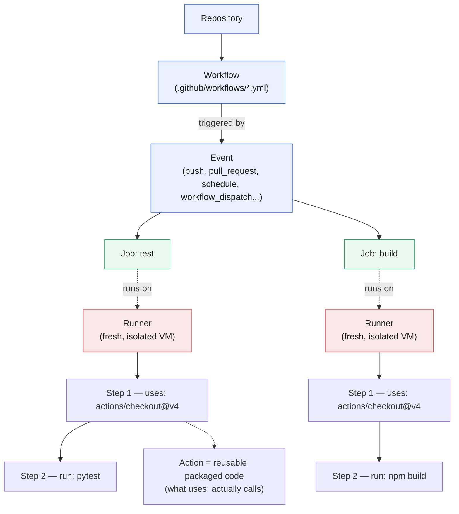

# Chapter 0: Foundations — How GitHub Actions Actually Works

*Last verified against upstream GitHub/Microsoft sources: September 13, 2026. Facts tied to a date (deprecations, defaults, retirements) can shift after this point — see the note in the README about re-checking time-sensitive claims.*

> **A note on sourcing.** The GH-200 exam blueprint changed during 2026. The current official Microsoft Learn page (last updated August 2026) lists **5 domains**: Author and manage workflows (20–25%), Consume and troubleshoot workflows (15–20%), Author and maintain actions (15–20%), Manage GitHub Actions for the enterprise (20–25%), Secure and optimize automation (10–15%). Some older cached guides and third-party practice tests still describe a retired 4-domain version. This guide follows the current 5-domain structure. Reconfirm against `learn.microsoft.com/credentials/certifications/github-actions` before your exam date, since Microsoft updates study guides periodically.

---

## 🎯 Learning Outcomes

After this chapter, you'll be able to:
- [ ] Explain the relationship between workflows, jobs, steps, actions, and runners
- [ ] Read and mentally parse any workflow YAML file
- [ ] Explain what a runner actually is and how work gets scheduled onto it
- [ ] Understand the event → workflow → job → step execution chain
- [ ] Know the difference between GitHub-hosted and self-hosted runners
- [ ] Navigate the Actions tab and read a workflow run's logs

**Estimated time:** 2-3 hours (reading + hands-on exploration)

---

## 0.1 The Core Vocabulary

GitHub Actions has five nested concepts. Get this hierarchy wrong and everything else in the exam becomes confusing.

```
REPOSITORY
  └── WORKFLOW (a YAML file in .github/workflows/)
        └── triggered by an EVENT (push, pull_request, schedule, etc.)
              └── JOB (a set of steps that run on one runner)
                    └── STEP (a single task: run a command, or use an action)
                          └── ACTION (a reusable unit of code someone packaged)
```

**Workflow** — A YAML file living at `.github/workflows/*.yml`. One repo can have many workflows. Each is independent unless you explicitly connect them (more on that in Chapter 3).

**Event** — Something that happens that GitHub notices: a push, a PR opened, a schedule firing, someone clicking "Run workflow" manually, an external system hitting a webhook. Every workflow needs at least one trigger under `on:`.

**Job** — A collection of steps that execute together, in order, on the **same runner**. Jobs in the same workflow run in **parallel by default**, unless you tell them not to with `needs:`.

**Step** — Either:
1. A shell command (`run: echo hello`), or
2. A call to a packaged **action** (`uses: actions/checkout@v4`)

**Runner** — The actual machine (VM or container) that executes a job. Every job gets a **fresh runner** — nothing persists between jobs unless you explicitly pass it via artifacts, cache, or outputs.

**The same hierarchy, as a diagram — notice jobs fan out in parallel and each lands on its own isolated runner:**



No shared line between `R1` and `R2` on purpose — that gap **is** the "jobs don't share a filesystem" rule from the real-world example below, drawn as a picture instead of stated as a sentence.

> **🎨 Diagram color key (applies throughout this guide).** Every Mermaid diagram in Chapters 0–5 reuses the same rough palette: **blue** = a structural/normal-path element (repos, workflows, events, everyday jobs), **green** = a job, gate, or "safe" outcome, **red** = a runner, watcher, danger path, or "unsafe" outcome, and **orange/yellow** (where used) = a conditional or gated step worth pausing on. It's not a rigid standard — always read the node label — but knowing the general convention up front means you spend less time decoding color and more time reading the shape of the flow.

> **🌍 Real-world example.** A team's CI workflow has two jobs: `test` and `build`. They noticed `build` couldn't see files that `test` had generated. This is not a bug — it's the model working as designed. Each job spins up on its own runner (its own fresh VM), so nothing written to disk in `test` exists in `build`'s filesystem. The fix: either combine both into one job (if they must share a filesystem), or pass the file between them using `actions/upload-artifact` in `test` and `actions/download-artifact` in `build`. This "jobs are isolated, sharing is explicit" model is the single most common point of confusion for people new to Actions, and a favorite exam trap.

---

## 0.2 Minimal Workflow Anatomy

```yaml
name: CI                          # Display name in the Actions tab

on:                                # What triggers this workflow
  push:
    branches: [main]
  pull_request:
    branches: [main]

jobs:                              # One or more jobs
  test:                            # Job ID (used for needs:, outputs, etc.)
    runs-on: ubuntu-latest         # Which runner image
    steps:                         # Sequential list of steps
      - name: Check out code
        uses: actions/checkout@v4  # An action

      - name: Set up Python
        uses: actions/setup-python@v5
        with:
          python-version: '3.12'

      - name: Install dependencies
        run: pip install -r requirements.txt   # A shell command

      - name: Run tests
        run: pytest
```

Walk through this line by line until it's automatic:
- `on:` fires this workflow on pushes to `main` and PRs targeting `main`.
- `jobs.test.runs-on` picks the runner image — here, GitHub's hosted Ubuntu 24.04 image (`ubuntu-latest`).
- Each `steps` entry is either `uses:` (run someone's packaged action) or `run:` (execute shell).
- Steps run **in order, top to bottom, on the same runner**, and share the filesystem within the job.

> **📚 Theory.** Why does `actions/checkout@v4` have to be the first step almost always? Because a fresh runner starts with **an empty filesystem** — it does not automatically have your repository's code. `actions/checkout` is the action that clones your repo onto the runner. Skipping it is one of the most common beginner mistakes: your very next step (`pip install -r requirements.txt`) fails because there's no `requirements.txt` on disk — nothing was ever checked out.

---

## 0.3 GitHub-Hosted vs Self-Hosted Runners

| | GitHub-hosted | Self-hosted |
|---|---|---|
| **Who manages it** | GitHub | You |
| **Cost model** | Billed per minute (free tier for public repos) | You pay for the infrastructure directly |
| **OS images** | Ubuntu, Windows, macOS (fixed images) | Anything you install |
| **Persistence** | Fresh VM every job, destroyed after | Can persist state between jobs (careful — see below) |
| **Networking** | Internet-facing, standard GitHub IP ranges | Runs inside your network — good for accessing private resources |
| **YAML label** | `runs-on: ubuntu-latest` | `runs-on: self-hosted` or a custom label |

**Current runner images (as of Sep 2026):** `ubuntu-latest` currently resolves to **Ubuntu 24.04**. Ubuntu 22.04 is in its deprecation window (begins deprecating **Sep 17, 2026**, fully unsupported by **April 2027**) — if you pin `ubuntu-22.04` in a workflow today, expect to need to move off it soon. Ubuntu 26.04 is available as a public preview if you want to pin it explicitly. This kind of "the `-latest` label quietly moves under you" detail is a real operational gotcha and shows up in exam scenario questions about pinning runner versions.

🔴 **Exam tip:** Know why someone would choose self-hosted runners: (1) need specialized hardware (GPUs), (2) need network access to private/on-prem resources, (3) want to control the exact software stack, (4) cost optimization at very high volume. Also know the security implication: self-hosted runners on **public repos** are a known attack vector — anyone who opens a PR can potentially get code to execute on your infrastructure via `pull_request_target` misuse. GitHub explicitly warns against self-hosted runners for public repos without additional controls.

> **🌍 Real-world example.** A hardware company needed their CI to run integration tests against physical GPUs for a computer-vision model. GitHub-hosted runners don't offer GPU access, so they registered self-hosted runners on machines with the actual GPUs, labeled them `runs-on: [self-hosted, gpu, linux]`, and scoped that runner group to only the specific repos that needed it. This is the textbook self-hosted use case: something the hosted fleet structurally cannot offer.

---

## ⚠️ Common Mistakes in This Chapter

❌ **Mistake:** Assuming steps in different jobs share files automatically.
✅ **Fix:** Each job = fresh runner. Use `upload-artifact`/`download-artifact` or `outputs` to pass data across jobs.

❌ **Mistake:** Forgetting `actions/checkout` and being confused why files "don't exist."
✅ **Fix:** Runners start empty. If you need your repo's code, checkout is step one, almost always.

❌ **Mistake:** Assuming `ubuntu-latest` is a fixed, unchanging environment.
✅ **Fix:** `-latest` labels move over time. Pin an explicit version (`ubuntu-24.04`) if you need reproducibility.

---

## 📝 TASK 0.1 — Read the Chain

**Task:** Without running anything, read this workflow and answer:
1. How many jobs does it have, and do they run in parallel or sequentially?
2. On the `deploy` job, what would happen if you removed `needs: build`?
3. What is `actions/checkout@v4` doing, and why does `build` need it but arguably `notify` might not?

```yaml
name: Pipeline
on:
  push:
    branches: [main]

jobs:
  build:
    runs-on: ubuntu-latest
    steps:
      - uses: actions/checkout@v4
      - run: echo "building..."

  deploy:
    runs-on: ubuntu-latest
    needs: build
    steps:
      - uses: actions/checkout@v4
      - run: echo "deploying..."

  notify:
    runs-on: ubuntu-latest
    needs: deploy
    steps:
      - run: echo "notifying team..."
```

<details>
<summary>🔎 Click to reveal solution</summary>

1. **3 jobs.** `build` runs first (no `needs`). `deploy` waits for `build` (`needs: build`). `notify` waits for `deploy`. So it's **sequential**: build → deploy → notify. Without any `needs:`, all three would instead start in parallel immediately.

2. Removing `needs: build` from `deploy` would make `deploy` start **immediately when the workflow triggers**, in parallel with `build`, instead of waiting for it to finish. This is dangerous here because `deploy` presumably depends on `build`'s output existing — removing the dependency could mean deploying before the build even finishes (or before it succeeds/fails).

3. `actions/checkout@v4` clones the repository onto that job's runner. `build` needs it because it presumably needs the source code to build. `notify` doesn't check out code at all — it just echoes a message, so it has no need for repo files. This illustrates that **checkout is not automatic or global** — it's a per-job, per-step choice, and you only pay for it (in runner time) where you actually need repo contents.

</details>

---

## 📝 TASK 0.2 — Spot the Bug

**Task:** This workflow is supposed to run tests on every push, but it's failing. Find the bug.

```yaml
name: Test Suite
on: push

jobs:
  test:
    runs-on: ubuntu-latest
    steps:
      - name: Install dependencies
        run: npm install

      - name: Run tests
        run: npm test

      - name: Check out code
        uses: actions/checkout@v4
```

<details>
<summary>🔎 Click to reveal solution</summary>

**Bug:** `actions/checkout@v4` is the **last** step instead of the **first**. Steps execute strictly top-to-bottom. By the time checkout runs, `npm install` and `npm test` have already tried to run against an empty filesystem (no `package.json` exists yet) — both would fail immediately with something like "no such file or directory."

**Fix:** Move the `Check out code` step to be first:
```yaml
steps:
  - name: Check out code
    uses: actions/checkout@v4

  - name: Install dependencies
    run: npm install

  - name: Run tests
    run: npm test
```

This is a deliberately simple bug, but it's exactly the kind of "read the YAML and spot what's out of order" question you'll see in the **Consume and troubleshoot workflows** domain (Chapter 2).

</details>

---

## 0.4 Navigating the Actions Tab (Hands-On)

You don't need a real project yet to explore this — if you have any GitHub account, create a throwaway repo now and try this:

1. Add a `.github/workflows/hello.yml` file with the minimal workflow from §0.2 (swap in a simple `run: echo "hello world"` step instead of the Python-specific ones).
2. Push it and go to the **Actions** tab.
3. Click into the running/completed workflow → click a job → **expand each step**.
4. Note where the "Set up job" and "Complete job" system steps appear — these aren't in your YAML, they're runner lifecycle steps GitHub adds automatically.
5. Find the **re-run** button (top right of a run) — note it can re-run all jobs or only failed jobs.

> **📚 Theory.** Every workflow run's log view maps 1:1 to your YAML's job/step structure, plus a few GitHub-injected steps (setting up the runner, checking billable time, tearing down). Learning to read this log view fluently — collapsing/expanding steps, jumping to the first red ❌ — is a skill the exam tests indirectly through log-reading scenario questions in Chapter 2 (Consume and troubleshoot workflows).

---

## ✅ Chapter 0 Summary (TL;DR)

- A **workflow** is a YAML file triggered by **events**; it contains **jobs**; jobs contain **steps**; steps run shell commands or call **actions**.
- Jobs run on **fresh, isolated runners** in **parallel by default** — use `needs:` to force order, and artifacts/outputs to share data.
- `actions/checkout` is not automatic — you add it explicitly, almost always as the first step, whenever a job needs repo contents.
- `ubuntu-latest` currently means Ubuntu 24.04, but that label moves over time — pin explicit versions for reproducibility.
- Self-hosted runners exist for GPU/network/cost reasons but carry real security tradeoffs on public repos.

**Next:** Chapter 1 goes deep on the domain worth the most exam weight — authoring and managing workflows: events, contexts, expressions, matrix builds, and job dependencies.
