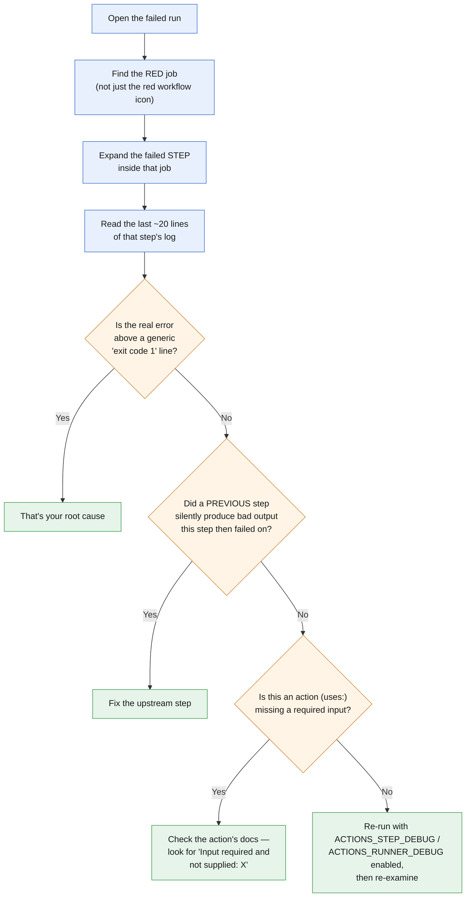
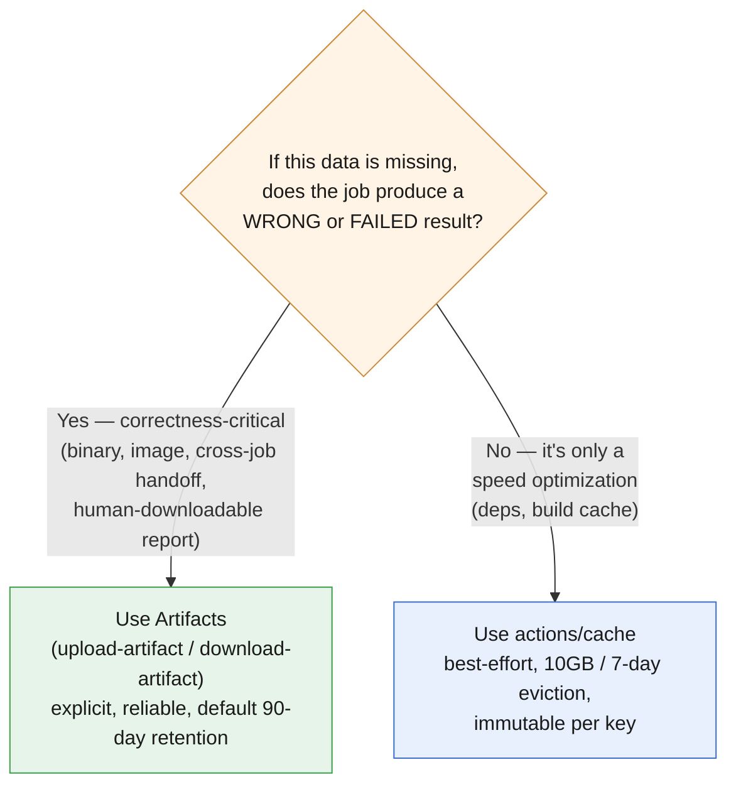

# Chapter 2: Consume and Troubleshoot Workflows (15–20% of exam)

*Last verified against upstream GitHub/Microsoft sources: September 13, 2026. Facts tied to a date (deprecations, defaults, retirements) can shift after this point — see the note in the README about re-checking time-sensitive claims.*

This domain tests a different skill than Chapter 1: not writing workflows from scratch, but **using workflows others wrote**, reading logs to diagnose failures, managing caching/artifacts, and consuming reusable workflows safely.

## 🎯 Learning Outcomes

- [ ] Read workflow run logs systematically to isolate a failure
- [ ] Diagnose the most common categories of workflow failure
- [ ] Use `actions/cache` correctly, including `restore-keys` fallback behavior
- [ ] Distinguish caching from artifacts and choose the right one
- [ ] Call a reusable workflow via `workflow_call`, including secret-passing rules
- [ ] Understand concurrency groups and how to cancel in-progress runs
- [ ] Re-run failed jobs vs entire workflows, and know what state persists across a re-run

**Estimated time:** 3-4 hours

---

## 2.1 A Systematic Debugging Workflow

When a workflow fails, resist the urge to guess — follow the same path every time:

```
1. Open the failed run → find the RED job (not just red workflow icon)
2. Expand the failed STEP inside that job (look for the ❌)
3. Read the last ~20 lines of that step's log BEFORE assuming the top-level error
   is the real cause — often the real error is buried above a "command failed
   with exit code 1" summary line
4. Check: did a PREVIOUS step in the same job silently produce wrong output
   that this step then failed on?
5. If it's an action (uses:), check the action's own documentation for
   required inputs you might have missed — the log often says
   "Input required and not supplied: X"
6. If needed, re-run with debug logging enabled (see below) and re-examine
```

**Enabling debug logs:** Set two repository secrets (not workflow-level, actual repo secrets):
- `ACTIONS_STEP_DEBUG` = `true` → verbose logs per step
- `ACTIONS_RUNNER_DEBUG` = `true` → verbose logs about the runner itself (environment setup, etc.)

> **🌍 Real-world example.** A workflow failed with a cryptic `Error: Process completed with exit code 1` and nothing else useful. The team enabled `ACTIONS_STEP_DEBUG`, re-ran, and the debug output revealed the actual npm error buried several lines above the generic "exit code 1" summary — a missing peer dependency that standard logging had truncated. This is the single most common "the log looks unhelpful" complaint on GH-200 style troubleshooting questions: the real signal is usually present, just not in the collapsed default view.

**The same path, as a flowchart** — follow it top to bottom every time, in order, before jumping to conclusions:



---

## 2.2 Common Failure Categories (and their signatures)

| Symptom | Likely cause | Where to look |
|---|---|---|
| `fatal: not a git repository` | Missing `actions/checkout` | First lines of the failing step |
| `Input required and not supplied: X` | Missing a required `with:` input on an action | The `uses:` step referencing that action |
| `Resource not accessible by integration` | `GITHUB_TOKEN` lacks the needed `permissions:` scope | Top of workflow / job `permissions:` block |
| `Error: Unable to resolve action ...` | Typo in action name/version, or action deleted/moved | The exact `uses:` string |
| Job shows `Skipped` (grey, not red) | An upstream `needs:` job failed, or an `if:` condition was false | The upstream job's result, or the skipped job's `if:` |
| Workflow doesn't trigger at all | Event/branch/path filter didn't match, or workflow file has YAML syntax error | `on:` block; also check the repo's "Actions" tab for a parse-error banner |
| `Error: Process completed with exit code 1` (no other detail) | Generic shell failure — the real cause is upstream in the log | Scroll up within the same step; enable debug logs if needed |
| Intermittent/flaky failures on service-dependent tests | Missing health check on a `services:` container | The `services:` block's `options:` |
| Every other matrix job suddenly shows `Cancelled` mid-run | One matrix combination failed and `fail-fast` (defaults `true`) killed the rest | Whichever matrix job actually shows red, not the cancelled ones — that's the real failure |

🔴 **Exam tip:** "Skipped" is not a failure. A grey/skipped job icon almost always means an upstream dependency failed or an `if:` evaluated false — GH-200 scenario questions frequently show you a run summary and ask you to identify *why* a specific job didn't run, testing whether you can distinguish "failed" from "skipped" from "cancelled."

**Matrix-specific troubleshooting note** (mechanics covered in Chapter 1 §1.5): a `Cancelled` matrix job is not itself the problem — `fail-fast: true` (the default) cancels every *other* in-progress or queued matrix combination the instant *any one* combination fails, so a run showing nine cancelled jobs and one red job means there's exactly one real failure to investigate, not ten. Chasing the cancelled jobs' logs wastes time; go straight to the single red one. If you need to see every combination's actual result during debugging (rather than have most of them cancelled), set `fail-fast: false` temporarily.

---

## 📝 TASK 2.1 — Diagnose From the Summary

**Task:** A workflow has 4 jobs: `lint` ✅, `test` ❌, `build` ⬜ (skipped), `deploy` ⬜ (skipped). The workflow YAML has:
```yaml
build:
  needs: [lint, test]
deploy:
  needs: build
```
Explain precisely why `build` and `deploy` show as skipped, and what — if anything — is wrong with the workflow.

<details>
<summary>🔎 Click to reveal solution</summary>

**Nothing is wrong with the workflow** — this is expected, correct behavior. `build` requires **both** `lint` and `test` to succeed (`needs: [lint, test]`). Since `test` failed, `build`'s implicit `if: success()` condition evaluates false, so `build` is skipped — not because of a bug, but because the dependency graph is working as designed. `deploy` needs `build`, and since `build` never ran (was skipped, not succeeded), `deploy` cascades to skipped too.

**The actual fix, if one is needed at all,** is in the codebase or test itself — go read `test`'s failure log. The workflow's control flow is behaving correctly; assuming the pipeline itself is broken here would be a misdiagnosis. This is exactly the kind of "is the failure in the code or the workflow" discrimination the exam tests.

</details>

---

## 2.3 Caching — Mechanics and Gotchas

```yaml
- uses: actions/cache@v4
  id: cache
  with:
    path: |
      ~/.npm
      node_modules
    key: ${{ runner.os }}-npm-${{ hashFiles('**/package-lock.json') }}
    restore-keys: |
      ${{ runner.os }}-npm-

- name: Install dependencies
  if: steps.cache.outputs.cache-hit != 'true'
  run: npm ci
```

**Key facts:**
- **Cache limit: 10 GB per repository by default** (can be increased by org/enterprise owners as of a Nov 2025 change, with billing for the extra). Once over the limit, **least-recently-used caches are evicted automatically**.
- **Caches unused for 7 days are evicted**, regardless of the size limit.
- **Caches are immutable once created** — you cannot update an existing cache entry under the same key; a new key is required to save new content (this is why the key typically includes a hash of the lockfile — when the lockfile changes, the hash changes, producing a fresh cache key).
- `restore-keys` provides **prefix-matching fallback**: if no exact match for `key` exists, GitHub Actions looks for the **most recent** cache whose key starts with any listed `restore-keys` prefix. This gives you a "close enough" cache (e.g., slightly stale `node_modules`) rather than nothing, which `npm ci` can then update incrementally.
- `cache-hit` output is `'true'` only on an **exact key match** — a `restore-keys` partial match sets `cache-hit` to `false`/empty, which is why the pattern above still runs `npm ci` on partial matches (to reconcile the near-miss cache with the actual lockfile).
- **Caching failure is non-fatal** — if a cache can't be restored or saved, the workflow proceeds; it just loses the speed benefit that run.

> **📚 Theory.** Why can't you "update" a cache under the same key? Caches are content-addressed by their key specifically so that a cache is deterministic and safe to restore concurrently across multiple parallel jobs — if caches were mutable, two jobs restoring "the same key" mid-write from a third job could get corrupted or inconsistent content. Immutability is what makes concurrent restores safe.

---

## 2.4 Caching vs Artifacts — Choose Correctly

| | Cache | Artifacts |
|---|---|---|
| **Purpose** | Speed up future runs by reusing unchanged dependencies/build products | Preserve output of a run for humans or downstream jobs to consume |
| **Lifetime** | Auto-evicted (10GB limit / 7-day unused rule) | Configurable retention (default 90 days, adjustable) |
| **Typical content** | `node_modules`, pip cache, Docker layers | Compiled binaries, test reports, coverage HTML, logs |
| **Cross-job sharing** | Yes, but treated as "best effort, might miss" | Yes, explicit and reliable — this is *the* mechanism for passing files between jobs |
| **Visibility** | Not meant for humans to browse | Downloadable from the Actions UI |

🔴 **Exam tip:** "How do I pass a compiled binary from a `build` job to a `deploy` job?" → **Artifacts** (`actions/upload-artifact` in `build`, `actions/download-artifact` in `deploy`), never cache. Cache is an optimization that might be silently missing; you should never depend on cache actually being present for correctness — only for speed.

```yaml
# In the `build` job:
- uses: actions/upload-artifact@v4
  with:
    name: compiled-binary
    path: dist/app.bin

# In the `deploy` job:
- uses: actions/download-artifact@v4
  with:
    name: compiled-binary
    path: dist/
```

---

## 📝 TASK 2.2 — Cache vs Artifact Design Call

**Task:** For each scenario, say whether `actions/cache` or `actions/upload-artifact`/`download-artifact` is the correct tool, and why:

1. Sharing a Docker image tarball built in `build` with the `scan` job that runs a vulnerability scanner on it.
2. Speeding up repeated `pip install -r requirements.txt` runs across many workflow runs over time.
3. Preserving a JUnit test report so a human can download and inspect it after a failed run.

<details>
<summary>🔎 Click to reveal solution</summary>

1. **Artifact.** This is cross-job data that `scan` *needs to function correctly* — if it were missing (which cache can be, silently), `scan` would have nothing to scan. Correctness-critical cross-job data = artifacts, never cache.

2. **Cache.** This is a pure speed optimization across runs over time — if the cache is missing on any given run, `pip install` just does a full install and the build still succeeds correctly, just slower. That's the definition of a good cache use case.

3. **Artifact.** Test reports are for human consumption after the fact, need to survive well past a single run's cache eviction window, and are exactly what `actions/upload-artifact` retention (default 90 days) is designed for.

</details>

**The decision, as a single question:**



If you'd be upset that a run silently skipped this data, it's an artifact. If a missing hit just makes the run a bit slower but still correct, it's a cache.

---

## 2.5 Consuming Reusable Workflows (`workflow_call`)

> **🔗 Try this in the Interactive Companion.** Secret propagation across a chain of nested `workflow_call`s (explicit pass-through vs `secrets: inherit`, and where the chain breaks) is exactly what `08_interactive_companion.html#secrets` (Secrets Tracer tab) visualizes — build a multi-hop chain and watch which secrets actually survive to the bottom.

```yaml
# Caller workflow
jobs:
  call-deploy:
    uses: my-org/shared-workflows/.github/workflows/deploy.yml@v2   # pin to a tag/SHA, not a branch
    with:
      environment: production
    secrets:
      DEPLOY_TOKEN: ${{ secrets.DEPLOY_TOKEN }}
      # OR, less securely: secrets: inherit
```

```yaml
# Reusable workflow (deploy.yml)
on:
  workflow_call:
    inputs:
      environment:
        required: true
        type: string
    secrets:
      DEPLOY_TOKEN:
        required: true

jobs:
  deploy:
    runs-on: ubuntu-latest
    steps:
      - run: echo "Deploying to ${{ inputs.environment }} with token ${{ secrets.DEPLOY_TOKEN }}"
```

**Key facts to memorize:**
- Reusable workflows are called **at the job level** (`jobs.<id>.uses:`), never inside a `steps:` list — that's what **composite actions** are for (Chapter 3).
- **Nesting limit: 4 levels deep.** Workflow A calls B calls C calls D — that's the max.
- **`secrets: inherit`** passes *all* of the caller's secrets down — convenient, but it's a **least-privilege violation** in security-conscious setups, since the reusable workflow gets access to secrets it may not need. The more secure pattern is naming secrets explicitly (as shown above).
- **Secrets only pass one hop at a time.** In a chain A→B→C, if A calls B with `secrets: inherit`, and B calls C, C does **not** automatically get A's secrets unless B explicitly re-passes them to C.
- **Environment secrets cannot flow through `workflow_call`.** If the reusable workflow's job specifies its own `environment:`, that job uses secrets from *that* environment directly — not whatever was passed from the caller. This is a very specific, frequently-tested gotcha.
- Pin reusable workflow references to a **tag or full commit SHA**, not a mutable branch — same supply-chain reasoning as pinning third-party actions (Chapter 5).

> **🌍 Real-world example.** A platform team built a shared `deploy.yml` reusable workflow used by 40+ repos, and initially had every caller use `secrets: inherit` for simplicity. A security review flagged this: any of those 40 repos' reusable-workflow calls now had blanket access to every secret in the calling repo, whether or not `deploy.yml` actually used them. They migrated to explicit `secrets:` mapping per caller — more YAML, but each caller now visibly declares exactly which secrets cross that boundary, which is both more secure and self-documenting during audits.

---

## 📝 TASK 2.3 — Trace the Secret Chain

**Task:** Given this chain, will job `C` have access to `secrets.PROD_KEY`? Why or why not?

```yaml
# workflow-A.yml (top-level caller)
jobs:
  call-b:
    uses: org/repo/.github/workflows/workflow-B.yml@v1
    secrets: inherit

# workflow-B.yml (reusable, called by A)
on:
  workflow_call:
jobs:
  call-c:
    uses: org/repo/.github/workflows/workflow-C.yml@v1
    # note: no `secrets:` key here at all

# workflow-C.yml (reusable, called by B)
on:
  workflow_call:
    secrets:
      PROD_KEY:
        required: true
jobs:
  deploy:
    runs-on: ubuntu-latest
    steps:
      - run: echo "${{ secrets.PROD_KEY }}"
```

<details>
<summary>🔎 Click to reveal solution</summary>

**No — this workflow will actually fail at the `call-c` step**, or at minimum `C`'s job will never receive `PROD_KEY`.

Reasoning: `secrets: inherit` in A→B means **B** receives all of A's secrets (assuming `PROD_KEY` exists as an actual repo/org secret named `PROD_KEY`). But that's where it stops. B's call to C (`call-c`) has **no `secrets:` key at all** — not `inherit`, not an explicit mapping. Secrets don't propagate automatically beyond one hop; B must explicitly do one of:

```yaml
call-c:
  uses: org/repo/.github/workflows/workflow-C.yml@v1
  secrets: inherit          # re-inherit and pass along, OR
  secrets:
    PROD_KEY: ${{ secrets.PROD_KEY }}   # explicit relay
```

Since C's `workflow_call` declares `PROD_KEY` as `required: true` and B never supplied it, this workflow would actually **fail validation** at dispatch time with a missing required secret — not silently run with an empty value. This "each hop needs its own explicit pass-through" rule is one of the most commonly missed facts about nested reusable workflows on the exam.

</details>

---

## 2.6 Concurrency Control

```yaml
concurrency:
  group: deploy-${{ github.ref }}
  cancel-in-progress: true
```

**What this does:** Only one workflow run matching this `group` key can be "active" at a time. If a new run starts for the same group while another is in progress, the **older one is cancelled** (because `cancel-in-progress: true`).

**Common use case:** preventing two simultaneous deploys to the same environment from a rapid sequence of pushes — you want the *latest* push's deploy to win, not have two deploys racing each other.

```yaml
# A more nuanced pattern: cancel superseded PR builds, but never cancel a main-branch deploy
concurrency:
  group: ci-${{ github.workflow }}-${{ github.ref }}
  cancel-in-progress: ${{ github.ref != 'refs/heads/main' }}
```

🔴 **Exam tip:** know that `concurrency` can be set at the **workflow level** (applies to the whole run) or **job level** (only that job queues/cancels independently). A scenario question might describe "rapid pushes triggering overlapping deploys" and expect you to recognize `concurrency` + `cancel-in-progress` as the fix.

---

## 2.7 Re-running Workflows — What Persists, What Doesn't

- **Re-run all jobs**: starts completely fresh — new runner, no cache carried over from the failed attempt (though `actions/cache` might still restore from *previous successful runs*, that's unrelated to the re-run itself).
- **Re-run failed jobs only**: only the jobs that failed (and their downstream dependents) re-execute; jobs that already succeeded keep their prior results and are **not** re-run. This is faster but means: if a *shared* step earlier in a succeeded job had a subtle problem that didn't cause failure but did produce bad output, re-running only failed jobs won't catch or fix that — it's not truly a clean-slate retry.
- Both options generate a **new run attempt** under the same run number (viewable via the "Attempt" dropdown in the UI), not a brand-new run ID.

> **🌍 Real-world example.** A `deploy` job failed due to a transient network blip while `build` had succeeded. The engineer used "re-run failed jobs" to save time — `build`'s artifact was still valid and available, so `deploy` re-ran and succeeded without rebuilding. Had `build` itself produced a subtly corrupted artifact that just happened not to trip an error, "re-run failed jobs" would have silently reused that same bad artifact — a full re-run would have been necessary to actually rule that out. Knowing this tradeoff is exactly what separates "knows the button exists" from "knows when to use it" on the exam.

---

## ⚠️ Common Mistakes in This Chapter

❌ Assuming a "Skipped" job indicates something is broken.
✅ Skipped almost always means an upstream failure or `if:` evaluated false — check the dependency graph first.

❌ Using cache for data another job needs to function correctly.
✅ Use artifacts for anything correctness-critical; cache is a speed optimization only, never guaranteed present.

❌ Assuming `secrets: inherit` propagates through multiple levels of nested reusable workflows automatically.
✅ Each hop needs its own explicit `secrets:` (inherit or named) — it does not cascade past one level.

❌ Forgetting environment secrets don't flow through `workflow_call` the way repo/org secrets do.
✅ A reusable workflow job with its own `environment:` pulls that environment's secrets directly, ignoring whatever the caller tried to pass.

---

## ✅ Chapter 2 Summary (TL;DR)

- Debug systematically: find the red **job**, then the red **step**, then read *above* the generic "exit code 1" line. Use `ACTIONS_STEP_DEBUG`/`ACTIONS_RUNNER_DEBUG` secrets for verbose logs.
- Learn the failure-signature table — most GH-200 troubleshooting questions map directly onto one of these known patterns.
- Cache: 10GB/7-day eviction, immutable per key, `restore-keys` gives prefix-match fallback, `cache-hit` only true on exact match. Never rely on cache for correctness.
- Artifacts: the correct tool for correctness-critical cross-job data and human-downloadable outputs.
- `workflow_call`: job-level only, 4-level nesting cap, secrets don't cascade past one hop, environment secrets bypass caller-passed secrets entirely.
- `concurrency` + `cancel-in-progress` prevents overlapping runs racing each other (classic deploy-safety pattern).
- "Re-run failed jobs" reuses prior successful jobs' results as-is — it is not a guaranteed clean-slate retry.

**Next:** Chapter 3 — Author and Maintain Actions: building custom JavaScript, Docker, and composite actions, and the metadata/versioning rules around them.
