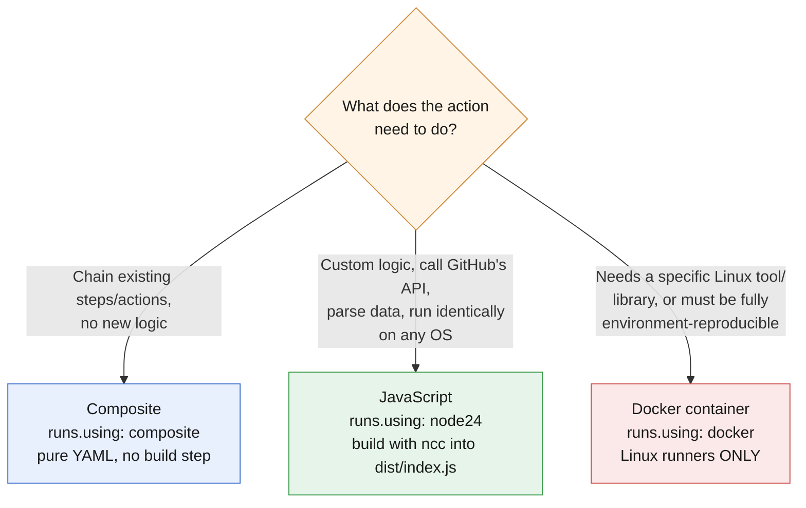

# Chapter 3: Author and Maintain Actions (15–20% of exam)

*Last verified against upstream GitHub/Microsoft sources: September 13, 2026. Facts tied to a date (deprecations, defaults, retirements) can shift after this point — see the note in the README about re-checking time-sensitive claims.*

Reusable *workflows* (Chapter 2) and reusable *actions* (this chapter) solve similar problems at different granularity. This chapter covers building your own actions: the three types (composite, JavaScript, Docker), `action.yml` metadata, versioning conventions, and troubleshooting each type.

> **⏰ Time-sensitive fact worth knowing cold for the exam:** Node.js 20 was **fully removed from GitHub-hosted runners on September 16, 2026** (Node 24 became the forced default back on June 2, 2026). If you see `runs: using: 'node20'` in an `action.yml` anywhere in exam material — real or in a question — treat it as **outdated**; the current correct value is `using: 'node24'`. This is exactly the kind of "the exam content may reference an older runtime" trap the exam's own note about GA-vs-Preview features is warning you about.

## 🎯 Learning Outcomes

- [ ] Choose the correct action type (composite / JavaScript / Docker) for a given problem
- [ ] Write a correct `action.yml` for each of the three types
- [ ] Understand `inputs`, `outputs`, and default values in action metadata
- [ ] Use workflow commands from within an action (including exit codes)
- [ ] Troubleshoot each action type when it fails
- [ ] Apply correct versioning/tagging conventions when publishing an action

**Estimated time:** 3-4 hours

---

## 3.1 Three Action Types — Choosing Correctly

| Type | `runs.using` | Runs where | Best for | Needs a build step? |
|---|---|---|---|---|
| **Composite** | `composite` | Directly on the runner, as a sequence of steps | Bundling existing steps/actions together — pure orchestration, no new logic | No — pure YAML |
| **JavaScript** | `node24` | Directly on the runner, via Node | Custom logic that needs to call GitHub's API, parse data, run fast | Yes — usually bundled with `ncc` into a single `dist/index.js` |
| **Docker container** | `docker` | Inside a container the runner starts | Needing a very specific OS/toolchain/dependency environment, or wrapping an existing CLI tool | Yes — Docker image build (or reference a pre-built image) |

🔴 **Exam tip:** a classic scenario question gives you a requirement and asks which action type fits. Quick heuristics:
- "Just chain a few existing actions/shell commands together" → **composite**
- "Needs to call the GitHub REST API and parse JSON quickly, must run on Windows/macOS/Linux identically" → **JavaScript**
- "Needs a specific Linux tool/library not available on the runner, or must run identically regardless of host OS quirks" → **Docker** (but note: Docker actions **only run on Linux runners** — this trips people up constantly)

> **🌍 Real-world example.** A security team needed an action to run a specific static-analysis binary that only existed as a Linux ELF binary with several system library dependencies. Rather than trying to install those dependencies on every consuming repo's runner, they wrapped the binary in a Docker container action — the Dockerfile installs exactly the right base image and dependencies once, and the action then runs identically everywhere, regardless of what's installed on the host runner. This is the textbook "Docker action" justification: environment reproducibility trumps flexibility here.

**The same heuristics, as a decision tree:**



The trap the exam sets most often: forgetting that the Docker branch comes with a hard constraint attached — **Docker container actions only run on Linux runners**, no matter how well-suited the logic seems otherwise.

---

## 3.2 Composite Actions

```yaml
# .github/actions/setup-and-lint/action.yml
name: 'Setup and Lint'
description: 'Sets up Node.js and runs the linter'
inputs:
  node-version:
    description: 'Node.js version to use'
    required: false
    default: '20'
outputs:
  lint-result:
    description: 'Pass or fail'
    value: ${{ steps.lint.outputs.result }}
runs:
  using: 'composite'
  steps:
    - name: Set up Node
      uses: actions/setup-node@v4
      with:
        node-version: ${{ inputs.node-version }}

    - name: Install dependencies
      run: npm ci
      shell: bash              # REQUIRED on every run: step in a composite action

    - id: lint
      run: |
        npm run lint
        echo "result=pass" >> "$GITHUB_OUTPUT"
      shell: bash
```

**Key facts:**
- Every `run:` step inside a composite action **must explicitly declare `shell:`** — unlike a normal workflow step, there's no default shell inferred for composite action steps.
- Composite actions can call **other actions** inside their `steps:` (including third-party ones) — this is how you "compose."
- Referenced as `uses: ./.github/actions/setup-and-lint` for a local action in the same repo, or `uses: org/repo/path@ref` for one from another repo.
- Inputs are accessed the same way as any action: `${{ inputs.node-version }}`.
- Outputs must be wired explicitly at the top-level `outputs:` block, referencing a `steps.<id>.outputs.<name>` — same pattern as job outputs in Chapter 1.

---

## 📝 TASK 3.1 — Fix the Composite Action

**Task:** This composite action fails immediately on any runner. Find the bug.

```yaml
name: 'Build Helper'
description: 'Builds the project'
runs:
  using: 'composite'
  steps:
    - name: Build
      run: npm run build
    - name: Report size
      run: du -sh dist/
```

<details>
<summary>🔎 Click to reveal solution</summary>

**Bug:** Neither `run:` step declares `shell:`. In a **composite action**, `shell:` is mandatory on every `run:` step — GitHub Actions does not infer a default shell for composite action steps the way it does for normal workflow steps (which default to `bash` on Linux/macOS, `pwsh` on Windows). Without it, the action fails to even parse/execute correctly.

**Fix:**
```yaml
runs:
  using: 'composite'
  steps:
    - name: Build
      run: npm run build
      shell: bash
    - name: Report size
      run: du -sh dist/
      shell: bash
```

This is one of the most commonly tested "gotcha" facts specifically about composite actions, precisely because it's easy to forget if you're used to writing normal workflow steps.

</details>

---

## 3.3 JavaScript Actions

```yaml
# action.yml
name: 'PR Labeler'
description: 'Labels a PR based on changed files'
inputs:
  github-token:
    description: 'Token for API access'
    required: true
  config-path:
    description: 'Path to label config'
    required: false
    default: '.github/labeler.yml'
outputs:
  labels-applied:
    description: 'Comma-separated list of labels applied'
runs:
  using: 'node24'          # current runtime — node20 was removed Sep 16, 2026
  main: 'dist/index.js'    # entry point — usually a bundled file, not raw source
```

```javascript
// src/index.js (bundled into dist/index.js before publishing, typically via @vercel/ncc)
const core = require('@actions/core');
const github = require('@actions/github');

async function run() {
  try {
    const token = core.getInput('github-token', { required: true });
    const configPath = core.getInput('config-path');

    // ... actual labeling logic using @actions/github's Octokit client ...

    core.setOutput('labels-applied', 'bug,needs-review');
  } catch (error) {
    core.setFailed(error.message);   // sets exit code 1 and surfaces the message as an error annotation
  }
}

run();
```

**Key facts:**
- `main:` points to the **built/bundled** JS file, not your raw source — this is why JS actions typically use a bundler (`@vercel/ncc` is the standard tool) to produce a single `dist/index.js` with all `node_modules` dependencies inlined, since the action runs standalone without an `npm install` step.
- `@actions/core` is the standard library for reading inputs (`core.getInput`), setting outputs (`core.setOutput`), and failing correctly (`core.setFailed`).
- `core.setFailed(message)` is the idiomatic way to fail an action — it sets the step's exit code to **1** and adds an error annotation with your message, which is more informative than an uncaught exception's raw stack trace.
- `@actions/github` provides a pre-authenticated Octokit client and the event payload context, so you don't have to build API calls from scratch.

> **📚 Theory.** Why bundle instead of shipping raw `node_modules`? Two reasons: (1) startup speed — a single bundled file loads faster than resolving a deep `node_modules` tree at runtime, and (2) reliability — consumers of your action don't need to run `npm install` themselves; the action is fully self-contained the moment it's checked out. This is a frequently tested distinction versus composite actions (no build step needed at all) and Docker actions (build step produces an image, not a JS bundle).

---

## 📝 TASK 3.2 — Diagnose the Failing JavaScript Action

**Task:** Consumers of your action report it always "succeeds" even when your internal logic clearly hit an error — no red X ever appears, but the output is obviously wrong. Here's the relevant code:

```javascript
async function run() {
  const token = core.getInput('github-token', { required: true });
  try {
    doSomethingThatMightThrow();
  } catch (error) {
    console.log('Error: ' + error.message);
  }
}
run();
```

<details>
<summary>🔎 Click to reveal solution</summary>

**Bug:** The `catch` block only does `console.log(...)` — it never calls `core.setFailed()` (or throws in a way that propagates to a non-zero exit code). From GitHub Actions' perspective, the process ran and exited cleanly (implicit exit code 0), so the step is marked ✅ successful regardless of what your internal logic actually did. Logging the error message makes it *visible in the log* but does **not** mark the action as failed.

**Fix:**
```javascript
async function run() {
  const token = core.getInput('github-token', { required: true });
  try {
    doSomethingThatMightThrow();
  } catch (error) {
    core.setFailed(error.message);   // <-- this is what actually fails the step
  }
}
run();
```

This exact pattern — "the action's logs show an error but the job is green" — is a direct test of whether you understand that **failure in GitHub Actions is driven by exit code / `core.setFailed()`, not by the mere presence of error text in the log.** This connects directly to the official exam bullet about "implementing workflow commands within an action... including exit codes."

</details>

---

## 3.4 Docker Container Actions

```yaml
# action.yml
name: 'Custom Linter'
description: 'Runs a specialized linting binary'
inputs:
  severity:
    description: 'Minimum severity to report'
    required: false
    default: 'warning'
outputs:
  issues-found:
    description: 'Number of issues found'
runs:
  using: 'docker'
  image: 'Dockerfile'         # can also reference a pre-built image, e.g. 'docker://ghcr.io/org/linter:v1'
  args:
    - '--severity'
    - ${{ inputs.severity }}
```

```dockerfile
# Dockerfile
FROM alpine:3.20
COPY entrypoint.sh /entrypoint.sh
RUN chmod +x /entrypoint.sh
ENTRYPOINT ["/entrypoint.sh"]
```

```bash
#!/bin/sh
# entrypoint.sh
SEVERITY=$1
echo "Running lint at severity: $SEVERITY"
# ... actual linting logic ...
echo "issues-found=3" >> "$GITHUB_OUTPUT"
exit 0    # non-zero here fails the step, same principle as JS actions
```

**Key facts:**
- **Docker container actions only run on Linux runners.** This is a hard platform constraint — attempting to use one on `windows-latest` or `macos-latest` fails outright. This is one of the single most-tested facts in this domain.
- `image:` can point to a `Dockerfile` (built fresh at job-run time — slower, but always current) or a pre-built image reference like `docker://ghcr.io/org/image:tag` (faster startup, but you own keeping it updated).
- `args:` map to the container's `ENTRYPOINT`/`CMD` arguments — this is how inputs typically flow into a Docker action, though you can also use environment variables.
- Exit code semantics are identical to JS actions: exit 0 = success, non-zero = failure. Workflow commands like writing to `$GITHUB_OUTPUT` work the same way inside the container (GitHub mounts the necessary files/env vars into the container).

> **🌍 Real-world example.** A team's Docker action worked fine in their own testing but failed for every consumer trying to use it in a matrix that included `windows-latest`. The error was a confusing "no runner available" rather than an obvious "Docker actions require Linux" message. Once diagnosed, the fix was either (a) restricting the calling job's matrix to only Linux, or (b) rewriting the action as a composite/JavaScript action if genuine cross-platform support was required. This exact failure mode — a Docker action silently excluded from non-Linux runners — is a favorite exam scenario precisely because the error message doesn't say the quiet part loudly.

---

## 📝 TASK 3.3 — Pick the Right Action Type

**Task:** For each requirement below, name the correct action type and give one sentence of justification:

1. An action that needs to run `terraform plan` using a specific pinned Terraform CLI version, and must behave identically regardless of what's installed on the consumer's runner.
2. An action that simply runs `actions/checkout`, then `actions/setup-python`, then `pip install`, in sequence — no custom logic, just convenient bundling.
3. An action that needs to call the GitHub GraphQL API, parse a complex JSON response, and must work on `windows-latest`, `macos-latest`, and `ubuntu-latest` matrix jobs.

<details>
<summary>🔎 Click to reveal solution</summary>

1. **Docker container action.** Pinning an exact CLI version and guaranteeing identical behavior regardless of the host runner's pre-installed tools is exactly what a Docker image gives you — the image *is* the environment.

2. **Composite action.** No custom logic is being written — this is pure orchestration of existing steps/actions. A composite action avoids the unnecessary overhead of a build step or container image for something this simple.

3. **JavaScript action.** Needs to run identically across all three OS families (rules out Docker, which is Linux-only) and needs real logic for GraphQL parsing (rules out pure composite, which has no computation of its own) — JavaScript with `@actions/github`'s Octokit client is the natural fit.

</details>

---

## 3.5 Publishing and Versioning Actions

```yaml
# Consumer's workflow — pinning strategies, from least to most secure:
- uses: my-org/my-action@main          # ❌ mutable branch — can change under you at any time
- uses: my-org/my-action@v1            # ⚠️ mutable tag by convention — maintainer COULD move it
- uses: my-org/my-action@v1.2.3        # ⚠️ still just a tag, same risk in principle
- uses: my-org/my-action@a1b2c3d4...   # ✅ full commit SHA — immutable, cannot be silently changed
```

**Key facts:**
- The common **major-version tag convention** (`@v1`, `@v2`) is a *social contract*, not a technical guarantee — well-behaved action maintainers move the `v1` tag forward to point at the latest compatible commit within that major version, but nothing stops a compromised or careless maintainer from pointing `v1` at something unexpected.
- **Pinning to a full commit SHA** is the only way to guarantee immutability — this is the recommended practice for security-sensitive workflows and is explicitly covered again in Chapter 5 (Secure and Optimize Automation), because it's a supply-chain security control as much as a versioning one.
- When you publish your own action to the Marketplace, `action.yml`'s `name`, `description`, and a `branding:` block (icon + color) control how it appears.

🔴 **Exam tip:** know the tradeoff table cold — `@main`/`@master` (worst, fully mutable), `@v1` (convention-based, moderate trust), `@<full-sha>` (best, cryptographically pinned). Expect at least one question phrased as "which of the following `uses:` lines represents the most secure pinning strategy."

**The maintenance cost of SHA pinning — and how to automate it away.** Pinning to a full commit SHA solves the security problem but creates a new one: a bare SHA gives you no visible signal of *when* a new version exists, so teams either never update (stale, slowly falling behind on fixes) or drift back to trusting a mutable tag out of convenience. **Dependabot** closes that gap for actions the same way it does for package dependencies:

```yaml
# .github/dependabot.yml
version: 2
updates:
  - package-ecosystem: "github-actions"
    directory: "/"
    schedule:
      interval: "weekly"
```

- With this file in place, Dependabot scans your workflows' `uses:` lines, and when a pinned action has a newer release, it opens a PR that bumps the **SHA** (with the human-readable version as a trailing comment, e.g. `@a1b2c3d... # v4.2.0`) — so you get a reviewable diff instead of a silent moving tag.
- This is the recommended pairing for the exam's expected answer: **SHA-pin for immutability, Dependabot for visibility** — neither alone is the complete practice. Pinning without Dependabot means you never update; a mutable tag without pinning means you have visibility but no immutability guarantee.
- The same `github-actions` ecosystem entry also catches reusable workflow references (`uses: org/repo/.github/workflows/x.yml@ref`), not just action references — one config covers both patterns from Chapter 2 and this chapter.

---

## ⚠️ Common Mistakes in This Chapter

❌ Forgetting `shell:` on composite action `run:` steps.
✅ Always declare it explicitly — composite actions have no default shell.

❌ Assuming a Docker action will work on Windows/macOS runners.
✅ Docker container actions are Linux-only, full stop.

❌ Catching an error and only logging it, without calling `core.setFailed()`.
✅ Logging is for visibility; only exit code / `setFailed()` actually marks the step failed.

❌ Referencing `runs: using: 'node20'` in new action.yml files.
✅ Node 20 was removed from runners Sep 16, 2026 — use `node24`.

❌ Trusting `@v1`-style tags as immutable.
✅ For genuinely security-sensitive workflows, pin to a full commit SHA.

❌ SHA-pinning actions once and never revisiting them.
✅ Add a `github-actions` entry to `dependabot.yml` so SHA bumps arrive as reviewable PRs.

---

## ✅ Chapter 3 Summary (TL;DR)

- Three action types: **composite** (orchestration, no build step, mandatory `shell:` per step), **JavaScript** (`node24`, bundled via `ncc`, `@actions/core`/`@actions/github`), **Docker** (Linux-only, image built from Dockerfile or pre-built reference).
- Failure is driven by **exit code**, not log content — `core.setFailed()` in JS, non-zero `exit` in Docker/shell.
- Node 20 is gone from runners as of Sep 16, 2026 — `node24` is current.
- Versioning: `@main` (mutable, risky) < `@v1` (convention) < full commit SHA (immutable, most secure).
- SHA pinning alone loses visibility into updates — pair it with a `github-actions` entry in `dependabot.yml` so version bumps show up as reviewable PRs.

**Next:** Chapter 4 — Manage GitHub Actions for the Enterprise: runner groups, self-hosted runner scaling, org-level policies, and templated workflows.
