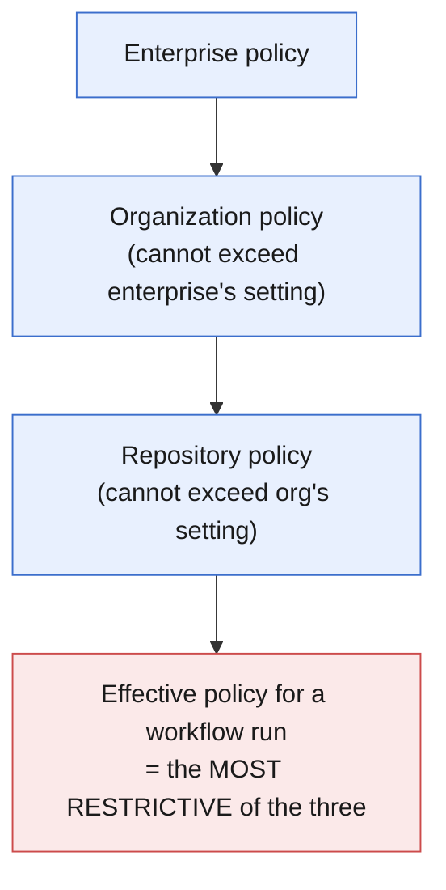
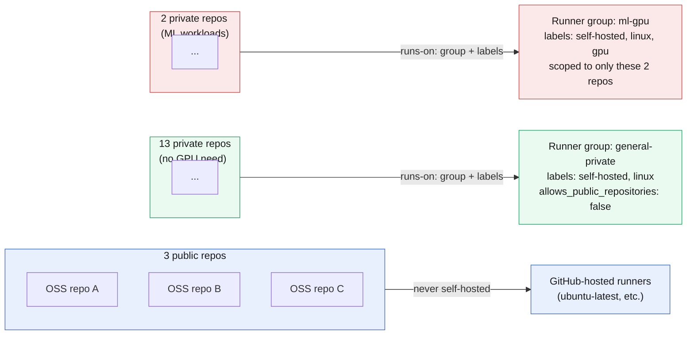
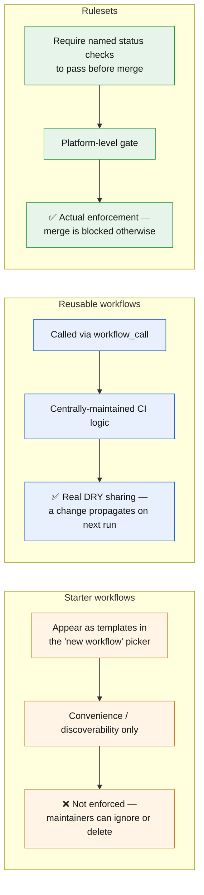

# Chapter 4: Manage GitHub Actions for the Enterprise (20–25% of exam)

*Last verified against upstream GitHub/Microsoft sources: September 13, 2026. Facts tied to a date (deprecations, defaults, retirements) can shift after this point — see the note in the README about re-checking time-sensitive claims.*

Tied for the largest domain. This is governance territory: who can use which actions, where self-hosted runners live and who can reach them, how organizations enforce policy across many repos, and how to distribute standardized workflows at scale.

> **⏰ Time-sensitive fact:** "Required workflows" (an older GitHub Enterprise feature that forced a workflow to run as a required PR status check org-wide) have been **retired** — GitHub's own current docs say plainly: *"GitHub no longer supports required workflows for GitHub Actions... use repository rulesets instead."* If exam prep material you find elsewhere still describes "required workflows" as the way to enforce org-wide CI, treat that as outdated. The current mechanism is **repository rulesets** with required status checks.

## 🎯 Learning Outcomes

- [ ] Configure organization/enterprise policies for which actions can run
- [ ] Set up and scope self-hosted runner groups correctly
- [ ] Understand runner scale sets and Actions Runner Controller (ARC) at a conceptual level
- [ ] Distribute standardized workflows across an org using starter workflows
- [ ] Enforce required CI checks using repository rulesets (the current mechanism)
- [ ] Understand billing/usage visibility at the org level

**Estimated time:** 3-4 hours

**On this page**
- [4.1 Allowed Actions Policy (Repo, Org, Enterprise Levels)](#41-allowed-actions-policy-repo-org-enterprise-levels)
- [4.2 Self-Hosted Runner Groups](#42-self-hosted-runner-groups)
- [4.3 Runner Scale Sets and Actions Runner Controller (ARC)](#43-runner-scale-sets-and-actions-runner-controller-arc)
- [4.4 Distributing Workflows at Scale](#44-distributing-workflows-at-scale)
- [4.5 Enforcing Required Checks — Repository Rulesets (Current Mechanism)](#45-enforcing-required-checks--repository-rulesets-current-mechanism)
- [4.6 Environments — Protection Rules, Required Reviewers, and Deployment Branch Policies](#46-environments--protection-rules-required-reviewers-and-deployment-branch-policies)
- [4.7 Organization-Level Visibility and Usage](#47-organization-level-visibility-and-usage)

---

## 4.1 Allowed Actions Policy (Repo, Org, Enterprise Levels)

Three levels can each set a policy, and a **more restrictive level always wins** — an enterprise-level lockdown overrides whatever an individual org tries to configure.

**The policy options, from most to least permissive:**

| Setting | What it allows |
|---|---|
| **Allow all actions and reusable workflows** | Anything, from anywhere |
| **Allow \<enterprise/org\>, and select non-\<enterprise/org\>, actions and reusable workflows** | Local + an explicit allowlist |
| **Allow \<enterprise/org\> actions and reusable workflows** | Only things defined inside your own enterprise/org — **this blocks `actions/checkout` and everything else GitHub-authored**, which surprises people |
| **Disable actions entirely** | Nothing runs |

**Allowlist syntax** (when using the "select actions" option):
```
actions/*                          # anything in the `actions` org
actions/checkout@*                 # any version of checkout specifically
space-org/*, !space-org/action@*   # allow the whole org, EXCLUDE one specific action
*, !untrusted-org/*                # allow everything, EXCLUDE one org
```
- `!` **excludes** — always evaluated as an override against whatever it's combined with.
- Max **1000 entries** in an allowlist.
- `./` (local actions in the same repo) are **never restricted** by these policies — you can always call your own repo's local actions regardless of policy.

🔴 **Exam trap:** "Allow \<enterprise/org\> actions and reusable workflows" (the strict local-only option) **blocks GitHub's own actions** (`actions/checkout`, `actions/setup-node`, etc.) because those live in the `actions` and `github` orgs, not inside your enterprise. A common exam scenario describes a workflow suddenly failing to find `actions/checkout` after a policy tightening — the fix is adding an explicit allow entry for `actions/*`, or choosing the "select actions" tier with "Allow actions created by GitHub" checked.

> **🌍 Real-world example.** A financial services org tightened their Actions policy to "local only" for compliance reasons, and every single workflow across 200+ repos broke overnight because they all used `actions/checkout` as their first step. The fix wasn't reverting the policy — it was moving to the "select actions" tier and explicitly allowlisting `actions/*` (GitHub's own actions) plus a small vetted list of third-party actions the org actually depended on, preserving the security intent while not breaking the fundamental "clone the repo" step every workflow needs.

**The hierarchy — most restrictive setting always wins, regardless of which level sets it:**



So if an enterprise admin locks things down to "local actions only," no org or repo admin underneath can loosen that back up to "allow all actions" — the tightest setting anywhere in the chain always governs.

---

## 📝 TASK 4.1 — Diagnose the Policy Lockout

**Task:** After an org-wide policy change, this previously-working step now fails with something like "Actions in this workflow must be within a repository that belongs to our enterprise account or created by GitHub":

```yaml
- uses: docker/build-push-action@v6
```

What happened, and what are the two possible fixes?

<details>
<summary>🔎 Click to reveal solution</summary>

**What happened:** The org (or enterprise) tightened its Actions policy — likely to "Allow \<enterprise\> actions" (local-only) or a "select actions" allowlist that doesn't include `docker/*`. `docker/build-push-action` is a third-party action (owned by Docker, not GitHub or the enterprise), so it's now blocked outright.

**Two fixes:**
1. If using the "select actions" tier: add `docker/*` (or the specific `docker/build-push-action@<version>`) to the allowlist.
2. If using strict "enterprise-only" with no allowlist option enabled: switch to the "select actions" tier, since strict enterprise-only mode has no exceptions mechanism at all — you must move to the tier that supports an allowlist before you can permit anything outside the enterprise.

The important conceptual point: this isn't a bug in the workflow — the workflow YAML is unchanged and correct. The failure is entirely a **policy-layer** rejection, which is why understanding this domain matters even though it has nothing to do with authoring workflow syntax.

</details>

---

## 4.2 Self-Hosted Runner Groups

```yaml
# Targeting a specific runner group + labels combo (recommended, unambiguous)
jobs:
  build:
    runs-on:
      group: production-runners
      labels: [self-hosted, linux, gpu]
```

**Key facts:**
- Every organization has a **default runner group**; additional groups require at least a GitHub Team plan (or enterprise).
- Each runner group has a **repository access policy**: which repos in the org can submit jobs to it. New groups **default to more restrictive visibility** for safety.
- **Public repositories default to NOT being allowed** to use a runner group (`allows_public_repositories: false`) — this is a deliberate safety default, because a public repo's PRs from forks are a well-known attack vector for hijacking self-hosted compute (an attacker opens a PR that runs arbitrary code on your infrastructure). You must explicitly opt a group in for public repo access, and should think hard before doing so.
- The `runs-on: { group:, labels: }` combined syntax (rather than just labels alone) exists specifically to prevent an **unintended runner** with matching labels — but belonging to a different, wrong group — from silently picking up your job. This is a real footgun the syntax was introduced to close.

> **📚 Theory.** Why is "public repo + self-hosted runner" dangerous by default? Anyone can open a pull request against a public repository. If that PR's branch modifies a workflow file, and that workflow runs on a self-hosted runner, an attacker can potentially get arbitrary code executing on infrastructure you control — not GitHub's ephemeral cloud VM, but your actual server, possibly with network access to internal systems. GitHub's own guidance explicitly recommends self-hosted runners be used with private repositories, and the `allows_public_repositories: false` default reflects that.

---

## 4.3 Runner Scale Sets and Actions Runner Controller (ARC)

For **autoscaling self-hosted runners** (rather than fixed static machines), the modern approach is **Actions Runner Controller (ARC)** running on Kubernetes, using **runner scale sets**.

**Key facts:**
- A **runner scale set** is a group of homogeneous, ephemeral runners whose active count is controlled by an autoscaler (ARC) rather than being fixed.
- A runner scale set belongs to **exactly one runner group** and has **exactly one label** — unlike traditional self-hosted runners, which can carry multiple labels.
- You target a scale set in a workflow the same way as any self-hosted runner — by referencing its group/label in `runs-on:`.
- If two scale sets are both online and eligible for a job, GitHub's assignment between them is **not configurable** — it's effectively a race; you don't get to control which one wins.
- If one Kubernetes cluster hosting an ARC installation goes down, a scale set in a *different* cluster continues acquiring jobs normally — this multi-cluster resilience is a specific, testable operational detail.

> **🌍 Real-world example.** A large engineering org running thousands of CI jobs/day moved from a fixed pool of 50 statically-provisioned self-hosted VMs to ARC-managed runner scale sets on Kubernetes. During low-traffic overnight hours, the scale set autoscaled down to near-zero running pods (saving significant compute cost); during a release-day traffic spike, it autoscaled up far beyond what 50 fixed VMs could have handled, without anyone manually provisioning anything. This elasticity — impossible with traditional static self-hosted runners — is the core value proposition ARC/scale sets solve for at scale, and is precisely why GH-200's enterprise domain tests this concept.

---

## 📝 TASK 4.2 — Runner Group Design

**Task:** Your org has:
- 3 public open-source repos
- 15 private internal repos
- One team needing GPU access for ML workloads (only 2 of the 15 private repos)

Design a runner group structure. How many groups, what visibility, what labels?

<details>
<summary>🔎 Click to reveal solution</summary>

**Recommended structure: 2 runner groups (plus GitHub-hosted runners for the public repos).**

1. **Public repos (3 of them):** Do **not** put them on self-hosted runners at all — use GitHub-hosted runners (`ubuntu-latest`, etc.). This sidesteps the entire "fork PR executes on your infra" risk category rather than trying to carefully firewall it. This is usually the right default answer whenever public repos are in scope.

2. **`general-private` runner group:** Scoped to the 13 private repos that don't need GPU. `allows_public_repositories: false` (default, and correct here since none of these are public anyway). Labels: `[self-hosted, linux]`.

3. **`ml-gpu` runner group:** Scoped specifically to just the 2 private repos needing GPU access — not all 15. Labels: `[self-hosted, linux, gpu]`. Keeping this group's repo-access list narrow (2 repos, not 15) follows least-privilege: the other 13 repos have no legitimate reason to be able to target expensive GPU hardware, and narrowing access reduces both cost-abuse risk and blast radius if one of those repos is ever compromised.

The key reasoning the exam wants: **match runner group scope to actual need**, keep public repos off self-hosted runners entirely by default, and don't create one all-encompassing group when workloads have genuinely different access requirements.

</details>

**That solution as a diagram — three repo populations, three different destinations:**



The point of drawing it this way: notice the GPU group's box only ever touches 2 repos, never all 15 — that narrowness is the least-privilege answer the exam is looking for, not an accident of the diagram layout.

---

## 4.4 Distributing Workflows at Scale

### Starter workflows (org-level templates)

Organizations can publish **starter workflows** — templates that appear in the "Actions" tab's "new workflow" picker for every repo in the org, similar to GitHub's own built-in starter workflows (Node.js CI, Docker publish, etc.) but customized to the org's own standards.

```
.github/workflow-templates/
├── my-org-ci.yml
├── my-org-ci.properties.json    # metadata: name, description, icon, categories
```

This is a **convenience/discoverability mechanism** — it makes it easy for repo maintainers to *start* with the org's blessed pattern, but critically, **it does not enforce anything**. A repo maintainer can still delete or never adopt the template. For actual enforcement, you need rulesets (next section) or reusable workflows that are mandated by process/review rather than by the platform itself.

### Reusable workflows for actual standardization

As covered in Chapter 2, `workflow_call` is how you get real, DRY, centrally-maintained CI logic — a change to the shared `deploy.yml` in one repo propagates to every caller automatically on their next run (assuming they don't pin to an old SHA). This is the stronger mechanism when consistency genuinely matters, versus starter workflows which are just a nicer onboarding experience.

🔴 **Exam tip:** know the distinction — **starter workflows = discoverability/convenience, not enforcement. Reusable workflows = actual shared, centrally-updated logic. Rulesets = actual enforcement of required checks.** A scenario question asking "how do you ensure every repo's CI includes a security scan step" is testing whether you reach for the enforcement mechanism (rulesets requiring a specific check to pass) rather than the discoverability one (starter workflow, which nobody's forced to keep using).

---

## 4.5 Enforcing Required Checks — Repository Rulesets (Current Mechanism)

```
Repo (or org) Settings → Rules → Rulesets → New ruleset
  Target: branches matching `main`
  Rules:
    ☑ Require status checks to pass
        - Add required check: "build" (must match a job name from your workflow)
        - Add required check: "security-scan"
```

**Key facts:**
- Rulesets can be defined at the **repository** level or the **organization** level (applying across many repos matching a pattern) — organization-level rulesets are how you achieve what "required workflows" used to do, before that feature was retired.
- A required status check name must match the **job name** (or a check name reported by an app/action) exactly — a common real-world mistake is renaming a job in the workflow YAML and forgetting to update the ruleset's required-check name, which then permanently shows as "expected — waiting for status to be reported" and blocks all merges.
- Rulesets can also enforce other things relevant to CI/CD hygiene: requiring signed commits, blocking force-pushes, requiring PR reviews — but for GH-200 purposes, the status-check enforcement piece is the one tied directly to Actions.

> **🌍 Real-world example.** A team renamed a job from `test` to `run-tests` in their workflow YAML during a refactor. Every subsequent PR got permanently stuck showing "Expected — Waiting for status to be reported" because the repository ruleset still required a check literally named `test`, which no longer existed. Nothing was wrong with the new workflow — the tests ran and passed fine under their new job name — but the ruleset's required-check name was now orphaned. The fix was updating the ruleset's required check name to match the renamed job. This "renamed a job, forgot to update the branch protection/ruleset required-check name" scenario is a very realistic, very common real-world (and exam-style) troubleshooting case that spans both this domain and Chapter 2.

---

## 📝 TASK 4.3 — Fix the Permanently Blocked PR

**Task:** A PR shows "Required check `deploy-check` — Expected — Waiting for status to be reported" indefinitely, even though the workflow ran successfully and all its jobs show green. The workflow's jobs are named `lint`, `test`, `build`. What's wrong, and what's the fix?

<details>
<summary>🔎 Click to reveal solution</summary>

**What's wrong:** The repository (or org) ruleset requires a status check named `deploy-check`, but no job in the workflow is named that — the actual jobs are `lint`, `test`, `build`. GitHub is correctly waiting for a check called `deploy-check` to report, but nothing will ever report under that name, so the PR is permanently blocked regardless of how many times the (differently-named) jobs succeed.

**Fix:** Either (a) rename one of the existing jobs to `deploy-check` if that's genuinely the intended gate, or (b) more likely, update the ruleset's required status check configuration to reference the correct, currently-existing job name (`build`, presumably, if that's meant to gate merges). This is purely a **configuration mismatch between the workflow YAML and the ruleset settings** — not a bug in either one individually.

</details>

**Three mechanisms, three different jobs — don't reach for the wrong one:**



If the question is "how do I make sure every repo's CI *actually* includes a security scan," the answer is a **ruleset** requiring that check — not a starter workflow, which is only ever a suggestion.

---

## 4.6 Environments — Protection Rules, Required Reviewers, and Deployment Branch Policies

Chapter 1 (§1.2) flagged that a `workflow_dispatch` input of `type: environment` renders a dropdown of your repo's configured **Environments**, and that selecting one enforces that environment's protection rules. This section is where those rules actually get configured — the mechanism that turns a plain `environment: production` line in a job into a real approval gate.

**Where it lives:** Settings → Environments → (create or select an environment, e.g. `production`).

**The three protection controls, and what each one gates:**

| Control | What it does | Typical use |
|---|---|---|
| **Required reviewers** | Pauses the job before it starts; up to 6 reviewers (users or teams) can be listed, and any one of them approving is enough to proceed by default | Human sign-off before a production deploy |
| **Wait timer** | Delays job start by a fixed number of minutes (0–43,200) after all other checks pass, no human action needed | A mandatory "cooling off" window before an auto-deploy goes out |
| **Deployment branch policies** | Restricts which branches (or tags) are allowed to deploy to this environment — e.g. only `main`, or only tags matching `v*` | Preventing an accidental deploy to `production` from a feature branch |

```yaml
jobs:
  deploy:
    runs-on: ubuntu-latest
    environment: production   # pulls this environment's secrets AND enforces its protection rules
    steps:
      - run: ./deploy.sh
```

**Key facts:**
- A job referencing `environment: production` **pauses at that job** (not the whole workflow — other jobs without an `environment:` keep running) until required reviewers approve and any wait timer elapses.
- Environment secrets (§5.4) and environment `vars` are **only** resolved for jobs that declare that `environment:` — this is the same mechanism, doing double duty as both a secrets scope and an approval gate.
- Reviewers see a dedicated "Review deployments" UI in the Actions run view — they don't need write access to the repo's code, just to be listed as a reviewer (or a member of a listed team) for that specific environment.
- Deployment branch policies default to **no restriction** when an environment is first created — you must opt in to restrict which branches can deploy, the same "safe by default, but not automatically locked down" pattern seen elsewhere in this chapter (e.g. runner group visibility, §4.2).

🔴 **Exam tip:** "How do I require a human to click approve before a workflow can deploy to production?" → **Environment required reviewers**, not a workflow-level `if:` condition — an `if:` expression evaluates once, instantly, with no mechanism to pause and wait for a person. This exact distinction is tested again in §5.4 from the secrets-handling angle; here it's the enterprise-governance angle on the same feature.

> **🌍 Real-world example.** An org let any successful build auto-deploy to production, and a bad config change shipped at 2 AM with nobody watching. The fix wasn't more tests — it was adding a `production` environment with two required reviewers from the on-call rotation and a 10-minute wait timer, so even an unattended pipeline can't push to production without either a human approval or, at minimum, a delay window during which someone monitoring alerts has a chance to cancel the run.

---

## 4.7 Organization-Level Visibility and Usage

- **Actions usage/billing** is visible at the organization (and enterprise) level under Settings → Billing, broken down by repository and by runner type (GitHub-hosted minutes vs self-hosted).
- Organization owners can see **all workflow runs across all repos** they administer, useful for auditing which repos are consuming disproportionate CI minutes.
- **Audit log** entries capture Actions-related administrative events (policy changes, runner registration/removal, secret creation/deletion) — this is the mechanism for answering "who changed the allowed-actions policy and when."

---

## ⚠️ Common Mistakes in This Chapter

❌ Assuming "required workflows" is still the mechanism for enforcing org-wide CI.
✅ It's retired — use repository/organization rulesets with required status checks instead.

❌ Tightening an Actions policy to "enterprise-only" without realizing it blocks `actions/checkout` and all GitHub-authored actions.
✅ Use the "select actions" tier with `actions/*` allowlisted, or explicitly check "Allow actions created by GitHub."

❌ Putting a public repo on a self-hosted runner group without carefully considering fork-PR risk.
✅ Default to GitHub-hosted runners for public repos; only opt a runner group into public access deliberately.

❌ Renaming a workflow job without updating the corresponding ruleset's required-check name.
✅ Treat the ruleset's required-check string as coupled to the job name — update both together.

❌ Treating starter workflows as an enforcement mechanism.
✅ They're discoverability/convenience only; use rulesets for actual enforcement, reusable workflows for actual shared logic.

❌ Trying to gate a production deploy on human approval using `if:`.
✅ Use an Environment's required reviewers — `if:` cannot pause a job to wait for a person.

---

## ✅ Chapter 4 Summary (TL;DR)

- Actions policy nests three levels (repo/org/enterprise); the most restrictive always wins. "Enterprise/org-only" mode blocks GitHub's own actions — a very common exam trap.
- Allowlist syntax: `owner/*` wildcards, `!` for exclusions, 1000-entry cap, local `./` actions always allowed regardless of policy.
- Runner groups gate which repos can submit jobs to which self-hosted runners; public repos default to **excluded** from runner groups for security reasons.
- Runner scale sets + ARC = modern autoscaling self-hosted runners on Kubernetes; one group, one label per scale set; cross-cluster resilience is automatic.
- Starter workflows = discoverability only. Reusable workflows = actual shared logic. Rulesets = actual enforcement.
- "Required workflows" is a **retired** feature — the current way to require a CI check org-wide is a **repository ruleset**.
- Environments (§4.6) provide three protection controls — required reviewers, wait timer, deployment branch policies — and are the only mechanism that can genuinely pause a job for human approval; `if:` cannot do this.

**Next:** Chapter 5 — Secure and Optimize Automation: secrets management, OIDC, `GITHUB_TOKEN` scoping, supply-chain pinning, and cost/performance optimization.
