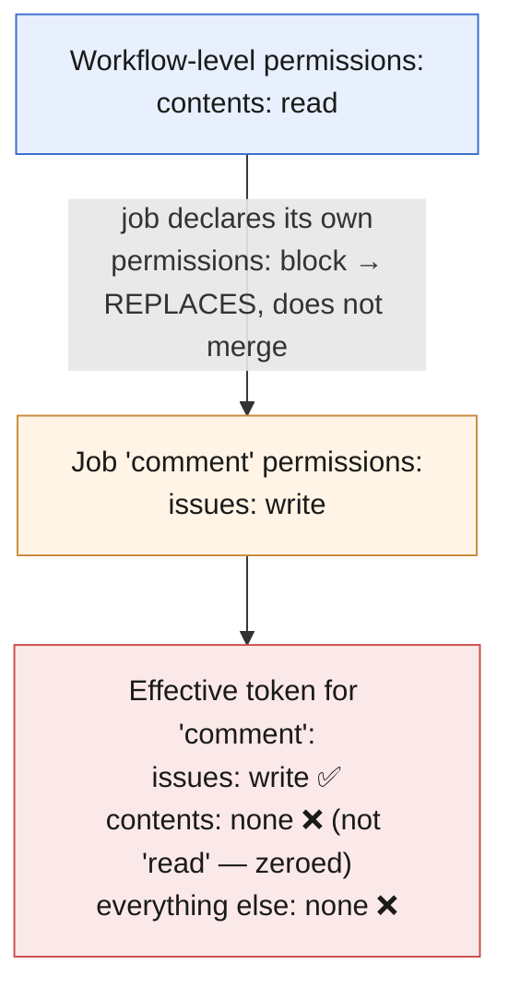
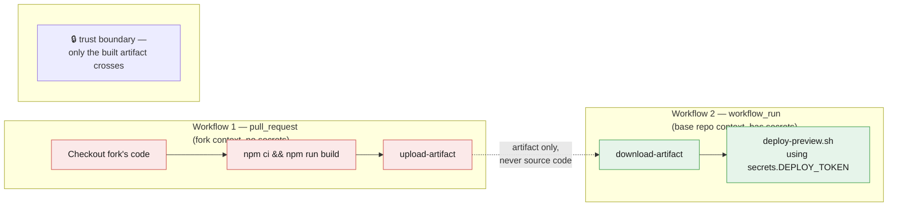
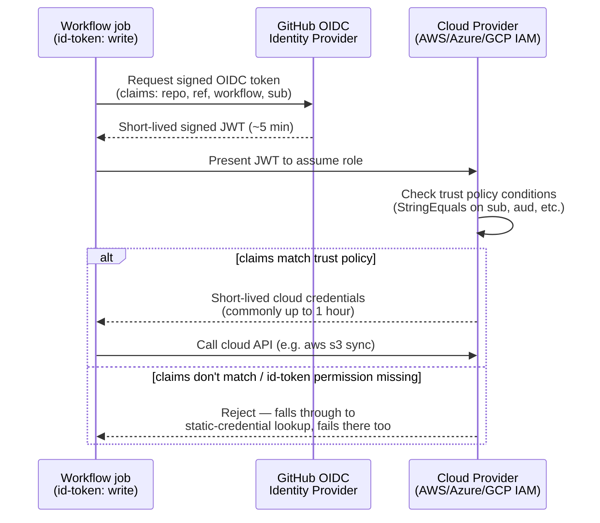

# Chapter 5: Secure and Optimize Automation (10–15% of exam)

*Last verified against upstream GitHub/Microsoft sources: September 13, 2026. Facts tied to a date (deprecations, defaults, retirements) can shift after this point — see the note in the README about re-checking time-sensitive claims.*

The smallest domain by weight, but arguably the most consequential in real production incidents. This chapter covers `GITHUB_TOKEN` scoping, secrets handling, OIDC (keyless cloud auth), the `pull_request` vs `pull_request_target` security trap, supply-chain pinning, and cost/performance optimization.

## 🎯 Learning Outcomes

- [ ] Explain `GITHUB_TOKEN`'s default behavior, including the "scope zeroing" rule
- [ ] Correctly identify the fork-PR security downgrade and when it doesn't apply
- [ ] Set up OIDC for keyless cloud authentication (AWS/Azure/GCP pattern)
- [ ] Recognize and avoid the `pull_request_target` code-execution trap
- [ ] Apply secrets-handling best practices (masking limitations, environment secrets, approval gates)
- [ ] Optimize workflows for cost and speed (caching, matrix tuning, concurrency, runner sizing)

**Estimated time:** 3-4 hours

**On this page**
- [5.1 GITHUB_TOKEN — Default Behavior and Scoping](#51-github_token--default-behavior-and-scoping)
- [5.2 The `pull_request` vs `pull_request_target` Trap](#52-the-pull_request-vs-pull_request_target-trap)
- [5.3 OIDC — Keyless Cloud Authentication](#53-oidc--keyless-cloud-authentication)
- [5.4 Secrets — Handling Best Practices](#54-secrets--handling-best-practices)
- [5.5 Supply-Chain Pinning (Recap and Extension)](#55-supply-chain-pinning-recap-and-extension)
- [5.6 Cost and Performance Optimization](#56-cost-and-performance-optimization)

---

## 5.1 GITHUB_TOKEN — Default Behavior and Scoping

**Key facts:**
- A **fresh `GITHUB_TOKEN` is minted per job** and expires when that job completes — it's never a long-lived credential.
- Since Feb 2023, **new repositories default to a read-only `GITHUB_TOKEN`** unless the workflow explicitly requests broader permissions via `permissions:`.
- **"Scope zeroing":** the moment you specify **any** individual permission in a `permissions:` block, every permission you *didn't* mention is set to `none` — not left at whatever the default was. This is the entire mechanism that makes least-privilege practical: you don't need to enumerate everything to *deny*, just declare what you *need*.

```yaml
permissions:
  contents: read
  pull-requests: write
# Everything else (issues, packages, deployments, actions, etc.) is now `none`,
# NOT whatever the repo/org default happened to be.
```

- **Pull requests from forks always receive a read-only token**, and **no access to secrets**, *regardless* of what `permissions:` says — this is a hardcoded safety floor that workflow YAML cannot override (with one important exception: `pull_request_target`, covered below).
- Shorthand: `permissions: read-all` / `permissions: write-all` exist but defeat the purpose of least privilege — the exam expects you to know they exist, but to prefer explicit narrow grants in real scenarios.

**Every `GITHUB_TOKEN` permission key, at a glance** — memorize this table well enough to answer "what's the minimum scope for task X" on sight, since that's the exact question format the exam favors (§1.7 covered the pattern; this is the full reference):

| Permission key | Controls access to | Common `write` use case |
|---|---|---|
| `actions` | Workflow runs, artifacts, caches | Cancelling or re-running workflows via API |
| `checks` | Check runs/suites | A custom action reporting its own check status |
| `contents` | Repo code, releases, tags | Pushing a commit, creating a release, `actions/checkout` needs `read` |
| `deployments` | Deployment records | Marking a deployment as successful/failed |
| `id-token` | OIDC token minting | Any cloud OIDC login action (§5.3) — always needs `write`, there's no partial scope |
| `issues` | Issues | An action that opens or comments on issues |
| `discussions` | Repo discussions | A bot answering/labeling discussions |
| `packages` | GitHub Packages (container/npm/etc. registries) | Publishing a package from CI |
| `pages` | GitHub Pages deployments | Deploying a static site via Actions |
| `pull-requests` | PRs (comments, labels, reviews) | An action commenting on or labeling a PR |
| `repository-projects` | Classic repo projects | Automation that moves cards on a classic project board |
| `security-events` | Code scanning alerts | Uploading SARIF via `github/codeql-action/upload-sarif` |
| `statuses` | Commit statuses | A third-party CI integration posting a commit status |

Two keys the exam singles out because they're easy to under-scope by habit: `id-token` has no "read" — it's either `write` (mint a token) or `none`, and it's the single most common cause of a working-then-suddenly-failing OIDC workflow (see TASK 5.3 below); `security-events: write` is the one people forget when a code-scanning upload step mysteriously 403s despite `contents: write` being set.

> **📚 Theory.** Why does GitHub bother minting a fresh, job-scoped token instead of using one long-lived credential? Because the blast radius of a leaked token is capped to exactly one job's lifetime and exactly the permissions that job declared — if a malicious dependency in step 3 of a job somehow exfiltrates `GITHUB_TOKEN`, it's useless within minutes and was never more powerful than `contents: read` in the first place (if that's all the job declared). This is the same "least privilege + short-lived" philosophy that underlies OIDC (§5.3) — GitHub Actions security design consistently favors ephemeral, narrowly-scoped credentials over static broad ones.

---

## 📝 TASK 5.1 — Predict the Token's Actual Permissions

**Task:** Given this block, what access does `GITHUB_TOKEN` actually have in this job?

```yaml
permissions:
  contents: read

jobs:
  comment:
    runs-on: ubuntu-latest
    permissions:
      issues: write
    steps:
      - run: echo "hi"
```

<details>
<summary>🔎 Click to reveal solution</summary>

**The `comment` job's token has exactly: `issues: write`, and everything else (including `contents`) is `none`.**

The key trap: the workflow-level `permissions: { contents: read }` might look like it applies as a "baseline" that the job then adds to — but that's not how it works. A **job-level `permissions:` block completely replaces** the workflow-level one for that job, not merges with it. Since the job specifies `issues: write` and nothing else, scope-zeroing kicks in at the job level too: everything unmentioned (including `contents`, which the workflow level *did* mention) is `none` for this specific job.

Practical consequence: if this job's `run:` step tried to do anything requiring `contents: read` (like checking out the repo with `actions/checkout`), it would fail — the workflow-level grant does not carry over. This exact "job-level permissions replace, don't merge with, workflow-level permissions" behavior is a frequently tested and frequently misunderstood mechanic.

</details>

**Scope-zeroing, visualized against Task 5.1's example:**



Two rules stack here: (1) mentioning **any** permission zeroes out everything unmentioned in that same block, and (2) a job-level block **replaces** the workflow-level block entirely rather than adding to it — so the workflow's `contents: read` never reaches this job at all.

---

## 5.2 The `pull_request` vs `pull_request_target` Trap

> **🔗 Try this in the Interactive Companion.** This is the single highest-stakes trap in the whole guide, and it's much more visceral to see triggered than to read about — open `08_interactive_companion.html#prtarget` (PR Trigger Simulator tab), flip on the "checkout fork code" and "execute fork code" toggles together under `pull_request_target`, and watch it flag the exact danger path described below.

This is one of the most consequential security topics on the exam, because getting it wrong in production has caused real credential-theft incidents.

| | `pull_request` | `pull_request_target` |
|---|---|---|
| **Runs in context of** | The **fork's** code and permissions | The **base repo's** code and permissions |
| **`GITHUB_TOKEN` for fork PRs** | Read-only, no secrets | **Full permissions as configured**, secrets available |
| **Checks out by default** | The PR's merge commit (fork code) | The **base branch**, NOT the fork's code (unless you explicitly check out the fork's ref) |
| **Safe for untrusted fork PRs?** | Yes, by design | **Only if you never execute the fork's code** |

**The trap:** `pull_request_target` exists precisely so you *can* run privileged actions (post a comment, apply a label) on a PR from a fork — but if a workflow using `pull_request_target` **also checks out and executes the fork's code** (e.g., `actions/checkout` with `ref: ${{ github.event.pull_request.head.sha }}`, then runs `npm install && npm test`), you've just handed an anonymous external contributor the ability to run arbitrary code **with your repo's full secrets and write permissions**. This has been the root cause of real supply-chain compromises.

```yaml
# ❌ DANGEROUS — do not do this
on: pull_request_target
jobs:
  test:
    runs-on: ubuntu-latest
    steps:
      - uses: actions/checkout@v4
        with:
          ref: ${{ github.event.pull_request.head.sha }}   # checks out FORK'S code
      - run: npm install && npm test    # runs fork's code WITH base repo's secrets/perms

# ✅ SAFE — pull_request_target used only for metadata operations, never executing fork code
on: pull_request_target
jobs:
  label:
    runs-on: ubuntu-latest
    permissions:
      pull-requests: write
    steps:
      - uses: actions/labeler@v5   # only reads PR metadata (changed files, etc.), never runs fork code
```

**The correct pattern when you genuinely need both** (build fork code AND post privileged results, e.g., a coverage comment): **split into two workflows**.
1. First workflow: triggered by `pull_request` (safe, read-only, runs fork code with no secrets), builds and uploads results as an **artifact**.
2. Second workflow: triggered by `workflow_run` (fires when the first workflow completes), runs in the base repo's **privileged** context, downloads the artifact from step 1, and posts the comment — **never executing the fork's code directly**.

> **🌍 Real-world example.** This exact anti-pattern — `pull_request_target` + checking out and running fork code — has been the mechanism behind real publicized GitHub Actions supply-chain compromises, where an attacker opened a malicious PR, and the CI workflow (intended to just run tests and post results) unknowingly executed the attacker's code with access to the repository's real secrets and write token. The fix in every such postmortem is the same: never combine `pull_request_target`'s elevated privileges with executing untrusted, PR-supplied code in the same job.

---

## 📝 TASK 5.2 — Spot the Vulnerability

**Task:** Identify exactly why this workflow is dangerous, and describe the safe redesign.

```yaml
name: PR Preview Deploy
on: pull_request_target

jobs:
  deploy-preview:
    runs-on: ubuntu-latest
    permissions:
      contents: read
      deployments: write
    steps:
      - uses: actions/checkout@v4
        with:
          ref: ${{ github.event.pull_request.head.sha }}
      - run: npm ci && npm run build
      - run: ./deploy-preview.sh
        env:
          DEPLOY_TOKEN: ${{ secrets.DEPLOY_TOKEN }}
```

<details>
<summary>🔎 Click to reveal solution</summary>

**The vulnerability:** This is the exact dangerous pattern from §5.2. Because the trigger is `pull_request_target`, this job runs with the **base repository's full permissions and secrets** — including `secrets.DEPLOY_TOKEN` — regardless of who opened the PR. But the workflow then explicitly checks out the **fork's** code (`ref: github.event.pull_request.head.sha`) and runs `npm ci && npm run build`, meaning any `package.json` script, build tool config, or source code an anonymous external contributor supplied in their PR **executes with access to `DEPLOY_TOKEN`**. A malicious PR could add a postinstall script to `package.json` that exfiltrates `DEPLOY_TOKEN` to an external server, and this workflow would run it automatically, with no review required, the moment the PR is opened.

**Safe redesign (two-workflow split):**

```yaml
# Workflow 1: build.yml — safe, runs on pull_request (fork code, no secrets)
on: pull_request
jobs:
  build:
    runs-on: ubuntu-latest
    steps:
      - uses: actions/checkout@v4
      - run: npm ci && npm run build
      - uses: actions/upload-artifact@v4
        with:
          name: build-output
          path: dist/

# Workflow 2: deploy-preview.yml — privileged, runs on workflow_run (base repo context)
on:
  workflow_run:
    workflows: ["build.yml"]
    types: [completed]
jobs:
  deploy-preview:
    if: github.event.workflow_run.conclusion == 'success'
    runs-on: ubuntu-latest
    permissions:
      deployments: write
    steps:
      - uses: actions/download-artifact@v4
        with:
          name: build-output
          run-id: ${{ github.event.workflow_run.id }}
      - run: ./deploy-preview.sh
        env:
          DEPLOY_TOKEN: ${{ secrets.DEPLOY_TOKEN }}
```

The fork's code (`npm ci && npm run build`) now only ever runs under `pull_request`'s safe, secret-free, read-only context. The privileged deploy step runs separately, in the base repo's context, and only ever touches the **already-built artifact** — never the fork's raw source or install scripts directly.

</details>

**The safe split as a diagram** — note the trust boundary sits between the two workflows, not inside one job:



The fork's raw code and install scripts never execute anywhere that has `secrets.DEPLOY_TOKEN` in scope — that's the entire point of the split.

---

## 5.3 OIDC — Keyless Cloud Authentication

Instead of storing long-lived cloud credentials (AWS access keys, Azure service principal secrets) as GitHub secrets, OIDC lets your workflow request a **short-lived, cryptographically signed identity token** from GitHub and exchange it for temporary cloud credentials.

```yaml
permissions:
  id-token: write   # REQUIRED — grants permission to request the OIDC token
  contents: read

jobs:
  deploy:
    runs-on: ubuntu-latest
    steps:
      - uses: aws-actions/configure-aws-credentials@v4
        with:
          role-to-assume: arn:aws:iam::123456789012:role/github-actions-deploy
          aws-region: us-east-1
      - run: aws s3 sync ./dist s3://my-bucket
```

**How it works (conceptually):**
1. GitHub acts as an **OIDC Identity Provider**; your cloud provider (AWS/Azure/GCP) is configured to **trust** GitHub's OIDC issuer (`https://token.actions.githubusercontent.com`).
2. The workflow requests a signed JWT from GitHub, containing claims like `repository`, `ref`, `workflow`, `sub` (subject — typically identifies the exact repo/branch/environment).
3. The cloud provider's IAM role has a **trust policy** conditioned on those claims (e.g., "only trust tokens where `sub` matches `repo:my-org/my-repo:ref:refs/heads/main`").
4. If the claims match, the cloud provider issues **short-lived** (commonly up to 1 hour, configurable) access credentials — no long-lived secret ever stored in GitHub.

**Key facts:**
- **`id-token: write` is the specific permission required** — without it, the OIDC token request fails, and cloud-auth actions typically fall back to looking for static credentials (which don't exist), producing a confusing generic "could not load credentials" error rather than an obvious permissions error.
- The OIDC token is short-lived (typically ~5 minutes) — it must be exchanged for cloud credentials quickly within the job.
- **Security hardening tip (and exam-relevant fact):** avoid `ForAllValues:` operators when writing the cloud-side trust policy conditions — they evaluate `true` when a claim is absent or misspelled, which can accidentally grant access broader than intended. Use `StringEquals`/`StringLike` instead.
- **New/renamed repos (as of July 15, 2026) get an immutable `sub` claim** that appends the permanent numeric IDs of the org and repo (not just the name) — this closes a real prior attack vector where a repo could be deleted and recreated (or an org/repo renamed) to "inherit" a stale trust-policy match meant for the original repo.

> **🌍 Real-world example.** A team previously stored a long-lived AWS access key pair as a GitHub secret for their deploy workflow. During a security audit, they migrated to OIDC: configured an AWS IAM role trusting GitHub's OIDC provider, scoped to only their exact repo and `main` branch via the `sub` claim condition, and removed the static AWS keys entirely. Now, even if a malicious dependency somehow exfiltrated the job's environment, there's no static credential to steal — the OIDC token is worthless outside that specific job's few-minute window, and the whole class of "leaked long-lived cloud credential" incidents is structurally eliminated for that workflow.

**The full exchange, step by step:**



No long-lived secret is stored anywhere in this exchange — both the OIDC token and the resulting cloud credentials are short-lived by design, which is why a leaked job environment doesn't translate into a standing compromise.

---

## 📝 TASK 5.3 — Debug the OIDC Failure

**Task:** This workflow suddenly starts failing with `Could not load credentials from any providers`. It worked last month. What's the most likely cause, given nothing in the `steps:` changed?

```yaml
on: push
jobs:
  deploy:
    runs-on: ubuntu-latest
    steps:
      - uses: aws-actions/configure-aws-credentials@v4
        with:
          role-to-assume: arn:aws:iam::123456789012:role/deploy
          aws-region: us-east-1
      - run: aws s3 sync ./dist s3://my-bucket
```

<details>
<summary>🔎 Click to reveal solution</summary>

**Most likely cause:** the workflow (or job) is **missing `permissions: { id-token: write }`**. Since nothing in `steps:` changed, the likely trigger is an **organizational or repository default permissions change** — for example, someone tightened the default `GITHUB_TOKEN` permissions org-wide, which (via scope-zeroing, §5.1) silently removed the implicit `id-token: write` this workflow had previously been relying on from a more permissive default.

**Fix:**
```yaml
permissions:
  id-token: write
  contents: read

on: push
jobs:
  deploy:
    runs-on: ubuntu-latest
    steps:
      - uses: aws-actions/configure-aws-credentials@v4
        with:
          role-to-assume: arn:aws:iam::123456789012:role/deploy
          aws-region: us-east-1
      - run: aws s3 sync ./dist s3://my-bucket
```

The generic, unhelpful error message (`Could not load credentials from any providers`) is itself a known signature — `configure-aws-credentials` tries OIDC first, fails silently on the missing permission, then falls through to checking for static env-var credentials (which were never configured), producing this misleading downstream error rather than a clear "missing id-token permission" message. Recognizing this error signature and immediately checking `permissions:` is a core troubleshooting reflex this exam rewards.

</details>

---

## 5.4 Secrets — Handling Best Practices

- **Masking is best-effort, not foolproof.** GitHub automatically redacts an exact secret value if it appears verbatim in logs — but a **transformed** version (base64-encoded, partially concatenated, or a substring) can slip through unmasked. Never assume a secret is safe just because it's marked as a "secret."
- **Environment secrets** (scoped to a GitHub Environment like `production`) support **protection rules**: required reviewers, wait timers, and branch restrictions — this is the mechanism for "someone must approve before this job can access the production deploy key." Configuring these rules is covered in full in Chapter 4 §4.6; this section is the secrets-scoping half of the same feature.
- **`secrets: inherit`** on reusable workflow calls trades convenience for least-privilege (see Chapter 2) — same principle applies here: prefer named, explicit secret-passing for anything security-sensitive.
- Secrets are **never available to workflows triggered by fork PRs** via `pull_request` (only via `pull_request_target`, with the risks described above) — this is a deliberate, hardcoded protection.

```yaml
jobs:
  deploy:
    runs-on: ubuntu-latest
    environment: production   # pulls this environment's secrets + enforces its protection rules
    steps:
      - run: ./deploy.sh
        env:
          DEPLOY_KEY: ${{ secrets.DEPLOY_KEY }}   # resolves from the `production` environment
```

🔴 **Exam tip:** "How do I require a human to approve before a workflow can deploy to production?" → **Environment protection rules** (required reviewers on the `production` environment), not a workflow-level `if:` condition — an `if:` can't pause and wait for human approval; only environment protection rules can.

---

## 5.5 Supply-Chain Pinning (Recap and Extension)

Chapter 3 covered pinning your **own published** actions; this section is about pinning **third-party dependencies** you consume.

- **Pin every third-party `uses:` to a full commit SHA**, not a tag, for anything security-sensitive — `@v4` can be repointed by the action's maintainer (or an attacker who compromises their account) to different code without you noticing, while a SHA is cryptographically immutable.
- Tools like **Dependabot** can be configured to open PRs bumping pinned action SHAs, giving you visibility and review on every version change rather than silently trusting a moving tag.
- This applies to composite/reusable workflow references too (Chapters 2–3) — same pinning discipline, same reasoning.

```yaml
# Weakest to strongest:
- uses: some-org/some-action@main                                          # ❌
- uses: some-org/some-action@v3                                            # ⚠️
- uses: some-org/some-action@8f4b7f84864484a7bf31766abe9204da3cbe65b3       # ✅
```

**The other half of supply-chain trust: proving what *you* shipped.** Pinning (above) is about trusting what you *consume*. **Artifact attestations** are about letting *others* verify what you *produce* — a cryptographically signed, tamper-evident record that a given binary/image/package was actually built by your workflow, from your source, and hasn't been swapped out afterward.

```yaml
jobs:
  build:
    runs-on: ubuntu-latest
    permissions:
      id-token: write        # attestations are signed via the same OIDC identity as §5.3
      attestations: write
      contents: read
    steps:
      - uses: actions/checkout@v4
      - run: ./build.sh
      - uses: actions/attest-build-provenance@v1
        with:
          subject-path: 'dist/my-app-binary'
```

- Build provenance attestations follow the **SLSA** framework's core idea: a verifiable, non-forgeable statement of *which workflow run, which commit, which source repo* produced an artifact — so a consumer downloading it later (or a security tool scanning your releases) can confirm it wasn't tampered with or built from unreviewed code.
- Like OIDC (§5.3), this needs `id-token: write` — attestations are signed using the workflow's own OIDC identity, not a long-lived key you manage.
- Verification happens on the consuming side with the `gh attestation verify` command, checking the artifact against the signed provenance GitHub stores for it.
- The exam-relevant distinction: **pinning protects you from a compromised dependency; attestation protects your downstream consumers from a compromised (or tampered) build of your own artifact.** They solve mirror-image problems in the same supply chain.

---

## 5.6 Cost and Performance Optimization

| Technique | Effect |
|---|---|
| **Cache dependencies** (`actions/cache`) | Fewer redundant downloads/builds per run |
| **Tune matrix size** | Avoid testing combinations that provide no real signal (Chapter 1) |
| **`concurrency` + `cancel-in-progress`** | Kill superseded runs (e.g., rapid pushes) before they finish, saving minutes |
| **`paths`/`paths-ignore` filters** | Skip triggering expensive workflows for irrelevant changes (e.g., docs-only) |
| **Right-size runners** | Don't use a larger (more expensive) runner than a job actually needs |
| **Self-hosted runners for heavy/long jobs** | Can be cheaper than GitHub-hosted minutes at high, sustained volume — but factor in the infrastructure and security overhead (Chapter 4) |
| **Conditional job execution (`if:`)** | Skip entire jobs when their outcome is already known to be irrelevant (e.g., skip deploy job on non-main branches) |

🔴 **Exam tip:** cost/performance questions on GH-200 are usually scenario-based ("this org's CI bill is high, what would you check first") rather than pure trivia — the expected answer path is usually: matrix bloat → missing caching → no concurrency cancellation → docs-only triggers running full CI, roughly in that order of common-and-fixable.

---

## ⚠️ Common Mistakes in This Chapter

❌ Assuming workflow-level `permissions:` merges with job-level `permissions:`.
✅ Job-level completely replaces workflow-level for that job — scope-zeroing applies at whichever level is most specific.

❌ Using `pull_request_target` and checking out + executing the fork's code in the same job.
✅ Split into two workflows: safe build on `pull_request`, privileged action on `workflow_run` consuming an artifact.

❌ Forgetting `id-token: write` when setting up OIDC — leads to a confusing generic credentials error, not an obvious permissions error.
✅ Always pair OIDC cloud-auth actions with an explicit `id-token: write` permission.

❌ Assuming a required-reviewer gate can be implemented with `if:`.
✅ Use Environment protection rules (required reviewers) — `if:` cannot pause for human approval.

❌ Trusting mutable tags (`@v1`, `@main`) for security-sensitive third-party actions.
✅ Pin to full commit SHAs; use Dependabot to manage SHA bumps with review.

---

## ✅ Chapter 5 Summary (TL;DR)

- `GITHUB_TOKEN` is job-scoped and short-lived; specifying any permission **zeroes out** everything unspecified; job-level permissions fully replace workflow-level, they don't merge.
- Fork PRs always get a read-only, secret-free token under `pull_request` — this is a hardcoded safety floor.
- `pull_request_target` grants base-repo privileges even for fork PRs — **never** combine it with checking out and executing the fork's code; split into two workflows if you need both privilege and fork-code execution.
- OIDC (`id-token: write`) replaces long-lived cloud secrets with short-lived, claim-conditioned tokens — new/renamed repos as of July 2026 get immutable numeric-ID-based `sub` claims to prevent name-recycling attacks.
- Environment protection rules (required reviewers) are the correct mechanism for human approval gates — not `if:` conditions.
- Pin third-party actions to full commit SHAs for security-sensitive workflows; tags are a convenience, not a security guarantee.
- Artifact attestations (`actions/attest-build-provenance`) let consumers verify *your* artifacts weren't tampered with — the mirror image of pinning, which protects *you* from tampered dependencies. Both need `id-token: write`.
- Cost/performance optimization: caching, matrix tuning, concurrency cancellation, path filters, right-sized runners — in roughly that order of common impact.

**Next:** Chapter 6 (the capstone) — a full CI/CD project stitching together workflow authoring, troubleshooting, custom actions, enterprise governance, and security hardening into one realistic pipeline, followed by rapid-fire mixed review questions across all five domains.
