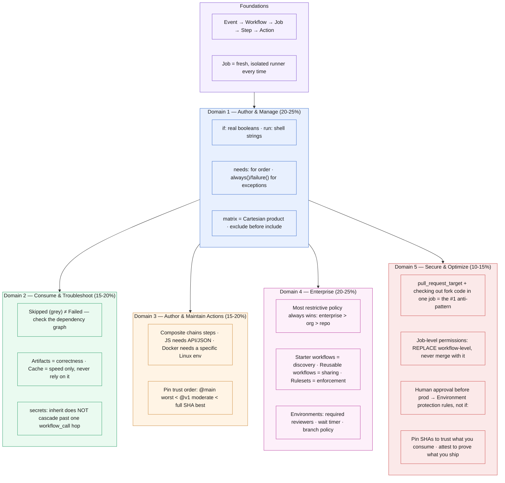

# Chapter 7: Quick Reference Edition

*Last verified against upstream GitHub/Microsoft sources: September 13, 2026. Facts tied to a date (deprecations, defaults, retirements) can shift after this point — see the note in the README about re-checking time-sensitive claims.*

A condensed, code-free companion to Chapters 0–5 — no theory, no worked examples, just the highest-yield facts pulled out and organized by domain. This is built for a final review pass, not first-pass learning: if a line here doesn't make sense, that's the signal to go back and read the full section it came from.

**How to use this:** skim domain-by-domain the night before, or Ctrl-F for a keyword mid-review. Every entry links back to a fuller explanation in its source chapter.

---

## ⏰ Time-Sensitive Facts (know these cold)

These changed during 2026 and are the easiest things to get wrong from older exam material.

- **Node.js 20 was fully removed from GitHub-hosted runners on September 16, 2026** (Node 24 became the forced default on June 2, 2026). If you see `runs: using: 'node20'` anywhere — in real material or in a question — treat it as outdated. Current correct value: `using: 'node24'`. *(Chapter 3)*
- **"Required workflows" is retired.** GitHub's own docs say plainly it no longer supports required workflows for enforcing org-wide CI. The current mechanism is **repository/organization rulesets** with required status checks. *(Chapter 4)*
- **`ubuntu-latest` currently means Ubuntu 24.04.** `ubuntu-22.04` began deprecating Sep 17, 2026 (fully unsupported by April 2027). Pin explicit versions for reproducibility. *(Chapter 0)*
- **New/renamed repos (as of July 15, 2026) get an immutable `sub` claim** for OIDC, appending permanent numeric org/repo IDs — this closes the old "delete and recreate a repo to inherit a stale trust policy" attack vector. *(Chapter 5)*

---

## Domain 1 — Author and Manage Workflows (20–25%)

**🔴 Exam tips**
- `inputs.dry_run` is a **real boolean** in `if:` expression syntax, but becomes the **literal string** `"true"`/`"false"` once interpolated inside a `run:` shell block.
- "How do I make a cleanup job run even if the build fails?" → `if: always()`. One of the most frequently tested behaviors on the whole exam.
- Minimum permission to comment on a PR → `pull-requests: write`, never `contents: write` or `write-all`.

**⚠️ Common mistakes**
- Expecting `pull_request` to fire on `labeled` without adding it to `types:` (default is only `opened`, `synchronize`, `reopened`).
- Comparing booleans to string literals in `if:` (`== "false"`) instead of real booleans.
- Using deprecated `::set-output` instead of writing to `$GITHUB_OUTPUT`.
- Forgetting a failed upstream job **skips** downstream jobs by default — needs explicit `if: always()` / `if: failure()`.
- Missing health checks on `services:` containers → flaky "connection refused" errors.

**Fast facts:** matrix = Cartesian product, `exclude` before `include`; `fail-fast` defaults `true`; 256-job matrix cap; service containers not supported the same way on Windows/macOS.

---

## Domain 2 — Consume and Troubleshoot Workflows (15–20%)

**🔴 Exam tips**
- "Skipped" (grey) ≠ failure. Almost always an upstream dependency failed or an `if:` evaluated false.
- Passing a compiled binary between jobs → **artifacts**, never cache. Cache might silently be missing; only use it for speed, never correctness.
- `concurrency` + `cancel-in-progress` is the fix for "rapid pushes triggering overlapping deploys."

**⚠️ Common mistakes**
- Treating a "Skipped" job as broken instead of checking the dependency graph first.
- Using cache for data another job needs to function correctly.
- Assuming `secrets: inherit` cascades through multiple levels of nested `workflow_call` automatically — it doesn't; each hop needs its own explicit `secrets:`.
- Forgetting environment secrets don't flow through `workflow_call` — a job with its own `environment:` pulls that environment's secrets directly.

**Fast facts:** cache = 10GB/repo default, 7-day idle eviction, immutable per key, `cache-hit` only true on exact match; artifacts = 90-day default retention, reliable cross-job sharing; `workflow_call` nesting cap = 4 levels; "re-run failed jobs" reuses prior successful jobs' results as-is.

---

## Domain 3 — Author and Maintain Actions (15–20%)

**🔴 Exam tips**
- Action-type heuristics: chain existing steps → **composite**; needs GitHub API + JSON parsing, cross-platform → **JavaScript**; needs a specific Linux tool/env → **Docker** (Linux-only).
- Pinning tradeoff, know it cold: `@main`/`@master` (worst, mutable) < `@v1` (convention, moderate trust) < full commit SHA (best, immutable).

**⚠️ Common mistakes**
- Forgetting `shell:` on composite action `run:` steps — composite actions have **no default shell**, unlike normal workflow steps.
- Assuming a Docker action works on Windows/macOS — it's Linux-only, full stop.
- Catching an error and only logging it, without calling `core.setFailed()` — the step still shows green.
- Trusting `@v1`-style tags as immutable — they're a social contract, not a technical guarantee.

**Fast facts:** JS actions use `node24`, bundled via `ncc` into `dist/index.js`; Docker `image:` can be a `Dockerfile` (built at run time) or a pre-built `docker://` reference; exit code (not log content) determines pass/fail for both JS and Docker actions. SHA-pin third-party actions, then add a `github-actions` entry to `dependabot.yml` so version bumps arrive as reviewable PRs instead of being invisible.

---

## Domain 4 — Manage GitHub Actions for the Enterprise (20–25%)

**🔴 Exam tips / traps**
- "Allow \<enterprise/org\> actions only" (strict local-only) **blocks `actions/checkout` and everything else GitHub-authored** — fix is the "select actions" tier with `actions/*` allowlisted.
- Know the distinction cold: **starter workflows = discoverability only. Reusable workflows = actual shared, centrally-updated logic. Rulesets = actual enforcement.**
- Environments are configured here (§4.6); a job pauses at *that job only*, not the whole workflow, while waiting on required reviewers or a wait timer.

**⚠️ Common mistakes**
- Assuming "required workflows" still exists (it's retired — see Time-Sensitive Facts above).
- Tightening a policy to "enterprise-only" without realizing it blocks GitHub's own actions.
- Putting a public repo on a self-hosted runner group without weighing fork-PR risk.
- Renaming a workflow job without updating the matching ruleset's required-check name — causes a PR to be permanently stuck "waiting for status to be reported."
- Treating starter workflows as enforcement (they're not).

**Fast facts:** most restrictive policy always wins across repo/org/enterprise; `!` excludes in allowlists, 1000-entry cap, local `./` actions always exempt; public repos default to **excluded** from runner groups (`allows_public_repositories: false`); a runner scale set = exactly one group + exactly one label, autoscaled by ARC. **Environments** (§4.6) give three protection controls — required reviewers (up to 6, any one approval proceeds), wait timer (0–43,200 min), deployment branch policies — and are the only mechanism that genuinely pauses a job for human approval.

---

## Domain 5 — Secure and Optimize Automation (10–15%)

**🔴 Exam tips**
- Human approval gate before a production deploy → **Environment protection rules** (required reviewers), never `if:` — an `if:` can't pause and wait.
- Cost/bill investigation order: matrix bloat → missing caching → no concurrency cancellation → docs-only triggers running full CI.

**⚠️ Common mistakes**
- Assuming workflow-level `permissions:` merges with job-level — **job-level completely replaces workflow-level**, it doesn't merge.
- Using `pull_request_target` while checking out and executing the fork's code in the same job — the single most consequential security anti-pattern on the exam. Safe fix: split into two workflows (`pull_request` builds, `workflow_run` deploys via artifact).
- Forgetting `id-token: write` for OIDC — produces a confusing generic credentials error, not an obvious permissions error.
- Trusting mutable tags (`@v1`, `@main`) for security-sensitive third-party actions.

**Fast facts:** `GITHUB_TOKEN` is minted per job, expires at job end; specifying any permission triggers **scope zeroing** (everything unmentioned → `none`); fork PRs under plain `pull_request` always get a read-only, secret-free token, hardcoded, no override. Full permission-key reference table (contents, issues, pull-requests, id-token, security-events, etc.) is in §5.1 — `id-token` has no "read," it's `write` or `none`. **Artifact attestations** (`actions/attest-build-provenance`, also needs `id-token: write`) are the mirror image of SHA pinning: pinning protects *you* from tampered dependencies, attestation lets *your* consumers verify *your* artifacts weren't tampered with.

---

## 🗺️ Everything at a Glance

One map of the whole exam — same color per domain as its weight below. If a box doesn't ring a bell, that's your cue for which chapter to reread tonight.

---

## ✅ One-paragraph summary of the whole exam

Workflows are YAML triggered by events, built from jobs and steps, running on fresh isolated runners — `needs:` and `if:` control flow, matrices multiply work, service containers add sidecar dependencies. Debugging means finding the red job, then the red step, then reading above the generic error. Actions come in three flavors (composite/JS/Docker) with different platform and tooling constraints. Enterprise governance nests three policy levels (most restrictive wins) and separates discoverability (starter workflows) from real standardization (reusable workflows) from real enforcement (rulesets). Security hinges on `GITHUB_TOKEN` scope-zeroing, never mixing `pull_request_target`'s privileges with executing fork code, and OIDC's `id-token: write` requirement — all in service of the same underlying principle: short-lived, narrowly-scoped credentials over static, broad ones.

**Next:** Run [Chapter 6](06_chapter_mcq_simulator.html) to test whether this actually stuck.
